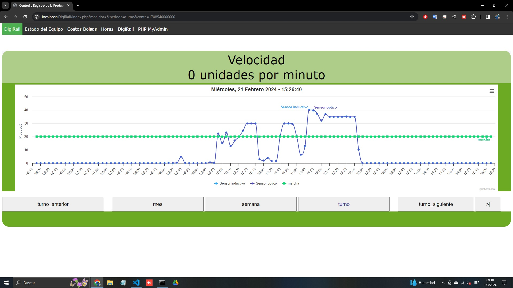

# Ejemplos de Uso de DigiRail para Monitoreo y Mejora de OEE

DigiRail ofrece una solución robusta para la adquisición automática de datos relevantes en entornos industriales. Aquí te mostramos cómo puedes utilizar DigiRail para monitorear vueltas de revolución, así como parámetros críticos como presión y temperatura, para mejorar tus métricas de OEE.

## Monitoreo de Vueltas de Revolución (Modo Contador)

DigiRail puede configurarse para capturar vueltas de revolución a través de entradas digitales en modo contador, permitiendo un seguimiento preciso de la actividad de la máquina.

### Configuración

1. Conecta tu sensor de revoluciones a la entrada digital de DigiRail designada para el modo contador.
2. A través del software de configuración de DigiRail, establece la entrada digital en modo "Contador".
3. Ajusta los parámetros según las especificaciones de tu sensor y las necesidades de monitoreo.

### Ejemplo de Aplicación

Imagina que deseas monitorear un motor que es crítico para tu línea de producción. Al configurar DigiRail para contar las vueltas de revolución, puedes:

- Detectar variaciones en la velocidad que podrían indicar mantenimiento preventivo necesario.
- Calcular el tiempo total de operación comparando los datos de revolución a lo largo del tiempo.

## Medición de Presión y Temperatura

Además de contar revoluciones, DigiRail es capaz de monitorear condiciones ambientales como la presión y la temperatura, fundamentales para el mantenimiento preventivo y la eficiencia operativa.

### Configuración

1. Conecta los sensores de presión y temperatura a las entradas analógicas correspondientes en DigiRail.
2. Configura cada canal en el software de DigiRail, seleccionando el tipo de señal adecuado (por ejemplo, 4-20 mA para presión, PT100 para temperatura).

### Ejemplo de Aplicación

Monitorear la presión y la temperatura en un sistema hidráulico te permite:

- Prevenir fallos por sobrecalentamiento o baja presión de operación.
- Ajustar operaciones en tiempo real para mantener la eficiencia energética.

## Cálculo de OEE

El OEE es un indicador clave de rendimiento que combina la disponibilidad, el rendimiento y la calidad. Con DigiRail, puedes:

- **Calcular la Disponibilidad**: Utiliza el tiempo de operación (derivado de las vueltas de revolución) sobre el tiempo planificado de producción.
- **Evaluar el Rendimiento**: Compara la cantidad teórica de producción con la cantidad real, ajustando por paros y ralentizaciones.
- **Medir la Calidad**: Relaciona la producción buena con la producción total.

DigiRail facilita la recopilación de datos necesarios para estas métricas, permitiéndote tomar decisiones basadas en datos para mejorar continuamente tu producción.

Para más detalles sobre la configuración específica y ejemplos avanzados, te invitamos a consultar el [manual completo de DigiRail](https://cdn.novusautomation.com/downloads/manual_digirail_connect_v10x_m_es.pdf).