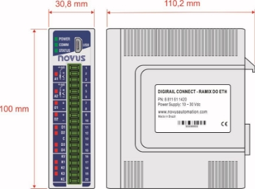
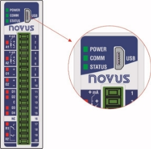
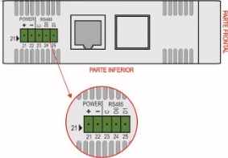
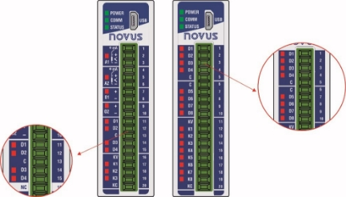
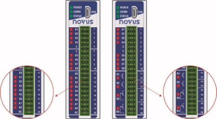



|
**DigiRail Connect**

**MANUAL DE INSTRUCCIONES V1.0x M** 
||||
| - | :- | :- | - |
|||||
1. [ALERTAS DE SEGURIDAD ...............................................................................................................................................................................4](#_page3_x54.00_y50.92)
1. [PRESENTACIÓN ...............................................................................................................................................................................................5](#_page4_x54.00_y50.92)
1. [IDENTIFICACIÓN ...............................................................................................................................................................................................6](#_page5_x54.00_y50.92)
1. [IDENTIFICACIÓN DEL DISPOSITIVO........................................................................................................................................................6](#_page5_x54.00_y70.92)
1. [MODELOS DEL DISPOSITIVO...................................................................................................................................................................6](#_page5_x54.00_y288.92)
1. [MODELOS RAMIX DO ETH / RAMIX RL ETH .................................................................................................................................6](#_page5_x54.00_y458.92)
1. [MODELOS DMIX DO ETH / DMIX RL ETH ......................................................................................................................................7](#_page6_x54.00_y50.92)
4. [INSTALACIÓN ....................................................................................................................................................................................................8](#_page7_x54.00_y51.04)
1. [INSTALACIÓN MECÁNICA .........................................................................................................................................................................8](#_page7_x54.00_y71.04)
1. [DIMENSIONES............................................................................................................................................................................................8](#_page7_x54.00_y320.04)
1. [RECOMENDACIONES PARA LA INSTALACIÓN ......................................................................................................................................8](#_page7_x54.00_y594.04)
5. [CARACTERÍSTICAS Y CONEXIONES .............................................................................................................................................................9](#_page8_x54.00_y51.04)
1. [CONEXIONES DE ALIMENTACIÓN ELÉCTRICA Y PUERTOS DE COMUNICACIÓN............................................................................9](#_page8_x54.00_y71.04)
1. [CONEXIÓN USB ...............................................................................................................................................................................9](#_page8_x54.00_y262.04)
1. [CONEXIÓN RS485............................................................................................................................................................................9](#_page8_x54.00_y592.04)
1. [CONEXIÓN ETHERNET .................................................................................................................................................................10](#_page9_x54.00_y266.04)
2. [AISLAMIENTO GALVÁNICO ....................................................................................................................................................................10](#_page9_x54.00_y318.04)
3. [ENTRADAS ANALÓGICAS .......................................................................................................................................................................11](#_page10_x54.00_y51.04)
1. [LED DE ESTADO DE A1 – A2 ........................................................................................................................................................11](#_page10_x54.00_y701.04)
1. [CONDICIÓN DE ERROR DE LAS ENTRADAS ANALÓGICAS .....................................................................................................12](#_page11_x54.00_y51.04)
1. [CONEXIONES DE LAS ENTRADAS ANALÓGICAS ......................................................................................................................12](#_page11_x54.00_y290.04)
4. [ENTRADAS DIGITALES ...........................................................................................................................................................................13](#_page12_x54.00_y51.04)
1. [LED DE ESTADO DE D1 ... D8 .......................................................................................................................................................13](#_page12_x54.00_y499.04)
1. [CONEXIONES DE LAS ENTRADAS DIGITALES ..........................................................................................................................13](#_page12_x54.00_y538.04)
5. [SALIDAS ANALÓGICAS ...........................................................................................................................................................................14](#_page13_x54.00_y51.04)
1. [LED DE ESTADO DE O1 – O2 .......................................................................................................................................................14](#_page13_x54.00_y628.04)
1. [CONEXIONES DE LAS SALIDAS ANALÓGICAS ..........................................................................................................................14](#_page13_x54.00_y677.04)
6. [SALIDAS DIGITALES ................................................................................................................................................................................15](#_page14_x54.00_y51.04)
1. [MODO DE ACCIÓN.........................................................................................................................................................................15](#_page14_x54.00_y376.04)
1. [ESTADO LÓGICO INICIAL .............................................................................................................................................................16](#_page15_x54.00_y161.04)
1. [VALOR DE ESTADO SEGURO (WATCHDOG) .............................................................................................................................16](#_page15_x54.00_y259.04)
1. [LED DE ESTADO DE K1 ... K8 / R1 ... R4 ......................................................................................................................................16](#_page15_x54.00_y336.04)
1. [CONEXIONES DE LAS SALIDAS DIGITALES TRANSISTOR ......................................................................................................16](#_page15_x54.00_y374.04)
1. [CONEXIONES DE LAS SALIDAS DIGITALES RELÉ ....................................................................................................................16](#_page15_x54.00_y542.04)
7. [LED ............................................................................................................................................................................................................16](#_page15_x54.00_y645.04)
1. [LED DE OPERACIÓN .....................................................................................................................................................................16](#_page15_x54.00_y670.04)
1. [LED DE COMUNICACIÓN RS485 ..................................................................................................................................................16](#_page15_x54.00_y719.04)
1. [LED DE ESTADO GENERAL ..........................................................................................................................................................17](#_page16_x54.00_y51.04)
1. [LED DE ESTADO DE CADA CANAL ..............................................................................................................................................17](#_page16_x54.00_y118.04)
6. [PROTOCOLO MODBUS ..................................................................................................................................................................................18](#_page17_x54.00_y51.04)
1. [COMANDOS..............................................................................................................................................................................................18](#_page17_x54.00_y91.04)
1. [READ COILS – 0X01 ......................................................................................................................................................................18](#_page17_x54.00_y122.04)
1. [READ DISCRETE INPUTS – 0X02 .................................................................................................................................................18](#_page17_x54.00_y307.04)
1. [READ HOLDING REGISTERS – 0X03 ...........................................................................................................................................18](#_page17_x54.00_y498.04)
1. [READ INPUT REGISTERS – 0X04.................................................................................................................................................18](#_page17_x54.00_y680.04)
1. [WRITE SINGLE COIL – 0X05 .........................................................................................................................................................19](#_page18_x54.00_y125.04)
1. [WRITE SINGLE HOLDING REGISTER – 0X06..............................................................................................................................19](#_page18_x54.00_y337.04)
1. [WRITE MULTIPLE HOLDING REGISTERS – 0X10 .......................................................................................................................19](#_page18_x54.00_y515.04)
1. [MASK WRITE REGISTER – 0X16 ..................................................................................................................................................20](#_page19_x54.00_y51.04)
2. [TABLA DE REGISTROS ...........................................................................................................................................................................20](#_page19_x54.00_y368.04)
7. [SOFTWARE DE CONFIGURACIÓN................................................................................................................................................................27](#_page26_x54.00_y51.04)
1. [NXPERIENCE ...........................................................................................................................................................................................27](#_page26_x54.00_y71.04)
1. [CONFIGURANDO DIGIRAIL CONNECT CON NXPERIENCE ................................................................................................................27](#_page26_x54.00_y166.04)
1. [INFORMACIÓN GENERAL DEL DISPOSITIVO .............................................................................................................................27](#_page26_x54.00_y218.04)
1. [ENTRADAS ANALÓGICAS .............................................................................................................................................................28](#_page27_x54.00_y51.04)
1. [ENTRADAS DIGITALES .................................................................................................................................................................28](#_page27_x54.00_y425.04)
1. [SALIDAS ANALÓGICAS .................................................................................................................................................................29](#_page28_x54.00_y103.04)
1. [SALIDAS DIGITALES ......................................................................................................................................................................30](#_page29_x54.00_y51.04)
1. [PARÁMETROS DE COMUNICACIÓN ............................................................................................................................................31](#_page30_x54.00_y51.04)
3. [DIAGNÓSTICOS .......................................................................................................................................................................................33](#_page32_x54.00_y51.04)
1. [FORZAR ENTRADAS DIGITALES .................................................................................................................................................33](#_page32_x54.00_y117.04)
1. [FORZAR ENTRADAS ANALÓGICAS .............................................................................................................................................33](#_page32_x54.00_y508.04)
1. [FORZAR SALIDAS DIGITALES ......................................................................................................................................................34](#_page33_x54.00_y51.04)
4. [FORZAR SALIDAS ANALÓGICAS .................................................................................................................................................34](#_page33_x54.00_y396.04)
4. [COMUNICACIÓN ............................................................................................................................................................................35](#_page34_x54.00_y51.04)
8. [ESPECIFICACIONES TÉCNICAS ...................................................................................................................................................................36](#_page35_x54.00_y51.04)
9. [GARANTÍA .......................................................................................................................................................................................................38](#_page37_x54.00_y51.04)
1. **ALERTAS DE SEGURIDAD ![ref1]**

Los siguientes símbolos se utilizan a lo largo de este manual para llamar la atención del usuario sobre información importante relacionada con la seguridad y el uso del dispositivo. 

||||
| - | - | - |
|
**CUIDADO** 

Lea completamente el manual antes de instalar y operar el dispositivo. 
|**CUIDADO O PELIGRO** Riesgo de choque eléctrico. |
**ATENCIÓN** 

Material sensible a la carga estática. Asegúrese de seguir las precauciones necesarias antes de la manipulación. 
|

Deben respetarse las recomendaciones de seguridad para garantizar la seguridad del usuario y prevenir daños al dispositivo o al sistema. Si el dispositivo se utiliza de manera distinta a la especificada en este manual, las protecciones de seguridad pueden no ser eficaces. 

2. **PRESENTACIÓN ![ref1]**

El módulo **DigiRail Connect** es un dispositivo que tiene diversos canales electrónicos de entradas y de salidas (I/Os) analógicas y digitales que se pueden acceder y comandar por medio de puertos de comunicación serial. 

**Figura 1 –**  Proceso **DigiRail Connect** 

El módulo **DigiRail Connect** tiene ocho modelos con cinco tipos distintos de canales: canales de entradas digitales (D), canales de entradas analógicas (A), canales de salidas digitales (K), canales de salidas de relé (R) y canales de salidas analógicas (O). 

Se puede realizar la configuración del módulo **DigiRail Connect** por medio del software configurador **NXperience**, que permite definir las funcio- nes y el modo de acción de los canales de entradas y de salidas, así como de sus puertos de comunicación. Además, el **NXperience** permite forzar valores en las entradas y en las salidas analógicas y digitales y realizar el análisis de información sobre la interfaz Ethernet y sobre el dispo- sitivo. 

3. **IDENTIFICACIÓN ![ref1]**
1. **IDENTIFICACIÓN DEL DISPOSITIVO** 

La identificación del modelo del dispositivo se describe en la etiqueta lateral, junto a información sobre la fuente de alimentación y el número de serie. La figura a continuación muestra la información disponible en la carcasa del dispositivo:  

**Figura 2 –  DigiRail Connect** 

2. **MODELOS DEL DISPOSITIVO** 

**DigiRail Connect** tiene cuatro modelos que apuntan a satisfacer las necesidades del usuario. Todos los modelos tienen una entrada USB, un puerto de comunicación serial RS485 y un puerto de comunicación Ethernet.  

Se pueden ver sus características particulares en la **Tabla 01**: 

<table><tr><th colspan="2"><b>Entrada Analógica</b> </th><th colspan="2"><b>Salida Analógica</b> </th><th colspan="1"><b>Entrada Digital</b> </th><th colspan="1"><b>Salida Digital Transistor</b> </th><th colspan="2"><b>Salida Digital Relé</b> </th></tr>
<tr><td colspan="1" rowspan="2"><b>RAMIX</b> </td><td colspan="1"><b>DO ETH</b> </td><td colspan="1">2 </td><td colspan="2">2 </td><td colspan="2">4 </td><td colspan="2">3 </td><td colspan="1">× </td></tr>
<tr><td colspan="1"><b>RL ETH</b> </td><td colspan="1">2 </td><td colspan="2">2 </td><td colspan="2">4 </td><td colspan="2">× </td><td colspan="1">2 </td></tr>
<tr><td colspan="1" rowspan="2"><b>DMIX</b> </td><td colspan="1"><b>DO ETH</b> </td><td colspan="1">× </td><td colspan="2">× </td><td colspan="2">8 </td><td colspan="2">8 </td><td colspan="1">× </td></tr>
<tr><td colspan="1"><b>RL ETH</b> </td><td colspan="1">× </td><td colspan="2">× </td><td colspan="2">8 </td><td colspan="2">× </td><td colspan="1">4 </td></tr>
</table>

**Tabla 1 –** Modelos de **DigiRail Connect** 

1. **MODELOS RAMIX DO ETH / RAMIX RL ETH** 

El modelo DO ETH tiene 2 entradas analógicas, 2 salidas analógicas, 4 entradas digitales y 3 salidas digitales, según la **Fig. 03**. 

El modelo RL ETH, a su vez, tiene 2 entradas analógicas, 2 salidas analógicas, 4 entradas digitales y 2 salidas de relé, según la **Fig. 04**. 

|||
| - | - |

**Figura 3 –**  Modelo DO ETH  **Figura 4 –**  Modelo RL ETH 

2. **MODELOS DMIX DO ETH / DMIX RL ETH** 

El modelo DO ETH tiene 8 entradas digitales y 8 salidas digitales, según la **Fig. 05**. 

El modelo RL ETH, a su vez, tiene 8 entradas digitales y 4 salidas de relé, según la **Fig. 06**. 

|||
| - | - |

**Figura 5 –**  Modelo DO ETH  **Figura 6 –**  Modelo RL ETH 

**NOVUS AUTOMATION  7/39**  

4. **INSTALACIÓN ![ref1]**
1. **INSTALACIÓN MECÁNICA** 

**DigiRail Connect** fue diseñado para que su carcasa sea fijada en riel DIN 35 mm, según la figura a continuación. La instalación del dispositivo en riel DIN 35 mm debe realizarse después de su configuración. 

**Figura 7 –**  Instalación mecánica 

2. **DIMENSIONES** 

**DigiRail Connect** posee una carcasa de alta calidad, construida en ABS + PC y con índice de protección IP20, que tiene las siguientes dimensio- nes: 

**Figura 8 –**  Dimensiones 

3. **RECOMENDACIONES PARA LA INSTALACIÓN** 
- Conductores de señales electrónicas y analógicas deben recorrer la planta por separado de los conductores de salida y de alimentación. Si es posible, en los electrodos puestos a tierra. 
- La alimentación de los instrumentos electrónicos debe venir de una red propia para la instrumentación. 
- Se recomienda el uso de FILTROS RC (supresores de ruido) en bobinas de contactores, solenoides, etc. 
- En aplicaciones de control, es esencial considerar lo que puede suceder cuando cualquier parte del sistema fallar. Los recursos internos de seguridad del dispositivo no garantizan una protección total. 
- Se deben realizar las conexiones eléctricas antes de insertar los bornes de conexión en el dispositivo. Antes de conectarlos, asegúrese de que las conexiones se han realizado correctamente. 

**NOVUS AUTOMATION  8/39 ![ref2]**

5. **CARACTERÍSTICAS Y CONEXIONES ![ref1]**
1. **CONEXIONES DE ALIMENTACIÓN ELÉCTRICA Y PUERTOS DE COMUNICACIÓN** 

Se pueden visualizar las conexiones de alimentación eléctrica y de los puertos de comunicación en la figura a continuación: 

**Figura 9 –**  Conexiones de alimentación eléctrica y puertos de comunicación 

Los terminales de alimentación eléctrica de **DigiRail Connect** se encuentran en la parte inferior de la carcasa. Se debe observar la polarización de esta conexión: Terminal 21 (+) y Terminal 22 (-). 

1. **CONEXIÓN USB** 

En su panel frontal, el **DigiRail Connect** ofrece un puerto USB, preferentemente destinado para la tarea de configuración y de diagnóstico del proceso monitoreado. Durante la instalación del software **NXperience**, los drivers del puerto USB se instalarán automáticamente. Durante el primer uso, se debe aguardar hasta que el Windows reconozca el driver de **DigiRail Connect**. 

|
![ref3]

![ref4]
|
**La interfaz USB NO ES AISLADA de los circuitos de entrada y salida digitales y del circuito del puerto RS485.** 

**La interfaz USB sólo permite la configuración del dispositivo, no su uso completo. La interfaz RS485 y las entradas y salidas analógicas y digitales sólo funcionarán cuando la fuente de alimentación esté conectada.** 
|
| - | :- |

**Figura 10 –**  Conexión del cable USB 

2. **CONEXIÓN RS485** 

La interfaz de conexión RS485 se encuentra en la parte trasera de **DigiRail Connect**, como se puede ver en la figura a continuación: 

**Figura 11 –**  Conexión de la interfaz RS485 

La interfaz RS485 puede configurarse para operar en las siguientes velocidades: 1200, 2400, 4800, 9600, 19200, 38400, 57600 y 115200. Ade- más, se puede configurar para operar con 1 o 2 Stop Bits y en paridades par, impar o ninguna. 

Se pueden encontrar más detalles sobre la implementación de una red de dispositivos Modbus vía RS485 en el documento "Conceptos Básicos de RS485 y RS422", disponible en[ www.novusautomation.com.](http://www.novusautomation.com/) 

La **Tabla 02** ayuda en la conexión de los conectores de la interfaz de comunicación RS485. 

<table><tr><th colspan="4" valign="top"></th><th colspan="1" rowspan="2">Conexión opcional que mejora el rendimiento de la comunicación. </th><th colspan="1" rowspan="2"><b>Terminal 23</b> </th></tr>
<tr><td colspan="4" valign="bottom"></td></tr>
<tr><td colspan="1" valign="top"></td><td colspan="1"></td><td colspan="1" valign="top"></td><td colspan="1" valign="top"></td><td colspan="1">Línea bidireccional de datos invertida. </td><td colspan="1"><b>Terminal 24</b> </td></tr>
<tr><td colspan="1" valign="top"></td><td colspan="1" valign="top"></td><td colspan="1" valign="top"></td><td colspan="1" valign="top"></td><td colspan="1">Línea bidireccional de datos. </td><td colspan="1"><b>Terminal 25</b> </td></tr>
</table>

**Tabla 2 –** Conexiones RS485 

|
![ref3]

![ref4]
|**El puerto RS485 NO ES AISLADO de los circuitos de entrada y salida digitales y del circuito del puerto USB.** |
| - | :- |

3. **CONEXIÓN ETHERNET** 

La interfaz Ethernet se encuentra en la parte trasera del **DigiRail Connect**, como se puede ver en la **Fig. 09**, y permite realizar la comunicación del dispositivo. 

2. **AISLAMIENTO GALVÁNICO** 

El **DigiRail Connect** tiene aislamiento galvánico entre las secciones funcionales del circuito interno para garantizar que las diferencias de poten- cial entre las partes del sistema de aplicación no interfieran en el correcto funcionamiento del dispositivo, asegurando el aislamiento eléctrico entre ellas. El aislamiento galvánico del **DigiRail Connect** puede verse en las siguientes figuras: 

|**Modelos RAMIX** |**Modelos DMIX** |
| - | - |
|||

**Figura 12 –**  Aislamiento galvánico 

3. **ENTRADAS ANALÓGICAS** 

**DigiRail Connect** tiene versiones con 2 canales de entradas analógicas, identificados como **A1** y **A2**, en su panel frontal. Esos canales están disponibles sólo en los modelos RAMIX y son propios para la medición de temperatura o de cualquier otra magnitud representada por señales eléctricas lineales estandarizadas. 

Su configuración ocurre de forma independiente a través del software de configuración **NXperience** (ver capítulo[ Software de Configuración)](#_page26_x54.00_y51.04). 

**Figura 13 –**  Entradas analógicas 

Los tipos de entrada posibles, junto a sus respectivos rangos de medición, se presentan en la **Tabla 03**: 

<table><tr><th colspan="1"><b>TIPO</b> </th><th colspan="1"><b>RANGO DE MEDICIÓN</b> </th></tr>
<tr><td colspan="1">J </td><td colspan="1">-110 a 950 °C (-166 a 1742 °F) </td></tr>
<tr><td colspan="1">K </td><td colspan="1">-150 a 1370 °C (-238 a 2498 °F) </td></tr>
<tr><td colspan="1">T </td><td colspan="1">-160 a 400 °C (-256 a 752 °F) </td></tr>
<tr><td colspan="1">N </td><td colspan="1">-270 a 1300 °C (-454 a 2372 °F) </td></tr>
<tr><td colspan="1">R </td><td colspan="1">-50 a 1760 °C (-58 a 3200 °F) </td></tr>
<tr><td colspan="1">S </td><td colspan="1">-50 a 1760 °C (-58 a 3200 °F) </td></tr>
<tr><td colspan="1">B </td><td colspan="1">400 a 1800 °C (752 a 3272 °F) </td></tr>
<tr><td colspan="1">E </td><td colspan="1">-90 a 730 °C (-130 a 1346 °F) </td></tr>
<tr><td colspan="1">Pt100 </td><td colspan="1">-200 a 850 °C (-328 a 1562 °F) </td></tr>
<tr><td colspan="1">Pt1000 </td><td colspan="1">-200 a 850 °C (-328 a 1562 °F) </td></tr>
<tr><td colspan="1">NTC </td><td colspan="1">-30 a 120 °C (-22 a 248 °F) </td></tr>
<tr><td colspan="1">0 – 60 mV </td><td colspan="1" rowspan="5">
Señales Analógicas Lineales Rango de medición configurable: 

- 65.535 hasta + 65.535 recuentos 
</td></tr>
<tr><td colspan="1">0 – 5 Vcc </td></tr>
<tr><td colspan="1">0 – 10 Vcc </td></tr>
<tr><td colspan="1">0 – 20 mA </td></tr>
<tr><td colspan="1">4 – 20 mA </td></tr>
</table>
**Tabla 3 –** Tipos de entrada aceptados y los rangos de medición de los sensores 

Los canales de entrada analógica **A1** y **A2** **no se aíslan eléctricamente** entre sí. **Están aislados** eléctricamente de otros circuitos de **DigiRail Connect**. 

Para el grupo **Sensores de Temperatura**, es necesaria la configuración de la unidad de temperatura. Para el grupo de **Señales Analógicas Lineales**, es necesaria la definición del rango de medición. 

Para todos los tipos de señales de entrada, es necesario definir valores para los siguientes parámetros de funcionamiento de los canales de entradas analógicas de **DigiRail Connect** (ver sección[ Entradas Analógicas ](#_page32_x54.00_y508.04)del capítulo[ Software de Configuración)](#_page26_x54.00_y51.04): 

- **Tasa de Muestreo:** Permite definir el número de lecturas realizadas cada segundo por el canal de entrada analógica sobre la señal de entra- da recibida: 1 lectura por segundo o 10 lecturas por segundo. 
- **Filtro:** Permite definir el valor de la **Constante de Tiempo** de un filtro a aplicar sobre la señal de entrada medida. Parámetro que se utiliza para mejorar la estabilidad de la señal medida. Ajustable entre 0 y 1200 segundos. 
1. **LED DE ESTADO DE A1 – A2** 

Cuando se encienden, los LED de estado de **A1** y **A2** indican que su canal está habilitado, no reflejando la condición o el valor de la señal presen- te en sus terminales. Además de señalar si un canal está o no habilitado, los LED de estado también informan, al parpadear, cuando hay algo indebido en el canal correspondiente. 

Condiciones indebidas en los canales de entrada se denominan "Condición de Error" y se tratan en párrafos específicos de este manual. 

2. **CONDICIÓN DE ERROR DE LAS ENTRADAS ANALÓGICAS** 

Se denomina "Condición de Error" toda condición de uso o de operación indebida para los canales de entrada de **DigiRail Connect**. Muchas de las condiciones indebidas son identificadas y luego señalizadas mediante el parpadeo del LED del respectivo canal. 

Las condiciones de error de las entradas analógicas se presentan en la tabla a continuación: 

|**TIPO DE ENTRADA** |**CONDICIÓN DE ERROR** |
| - | - |
|Sensores de Temperatura |
- Medidas más allá de los límites del rango de operación; 

- Entrada abierta / señal abierta. 
|
|0-20 mA |￿  Medidas por encima de 22 mA (± 0,5 mA) (\*). |
|0-5 / 0-10 V |
- Medidas por encima de 10 % del límite superior (\*); 

- Inversión de polaridad. 
|
|4-20 mA |
- Medidas por debajo de 3,5 mA (± 0,2 mA); 

- Medidas por encima de 22 mA (± 0,5 mA); 

- Entrada abierta / señal abierta; 

- Inversión de polaridad. 
|

**Tabla 4 –** Condiciones de error de las entradas analógicas (\*) No hay señalización de error cuando el dispositivo está con entrada abierta / señal abierta. 

3. **CONEXIONES DE LAS ENTRADAS ANALÓGICAS** 

**Figura 14 –**  TC / Pt100 / Pt1000 / NTC / V / mA 

4. **ENTRADAS DIGITALES** 

**DigiRail Connect** tiene versiones con 4 y 8 canales de entradas digitales, identificados como **D1 … D4 … D8**, en su panel frontal. Esos canales digitales son propios para recibir señales eléctricas de tipo Contacto Seco, NPN y PNP. 

Su configuración ocurre de forma independiente a través del software de configuración **NXperience** (ver capítulo[ Software de Configuración)](#_page26_x54.00_y51.04). 

**Figura 15 –**  Entradas digitales 

Las entradas digitales pueden ejecutar diversas funciones, que se definirán durante su configuración (ver sección[ Entradas Digitales ](#_page27_x54.00_y425.04)del capítulo [Software de Configuración)](#_page26_x54.00_y51.04). Las funciones disponibles son: 

- **Estado Lógico:** Cuando configurado como **Estado Lógico**, permite que el dispositivo relacione los niveles de tensión que fueron ingresados en la entrada digital con los estados lógicos **0** y **1**. 
- **Nivel Lógico Alto (1):** Tensión mayor que 2,2 V; 
- **Nivel Lógico Bajo (0):** Tensión menor que 1,5 V. 
- **Contador**: Permite que la entrada digital cuente el número de pulsos recibidos en sus terminales. Como referencia para incrementar el conteo, se puede utilizar el borde de subida (transición de **0** a **1**) o el borde de descenso (transición de **1** a **0**) del pulso recibido. 
- **Integrador ON/OFF:** Permite realizar la suma (integración) de los intervalos de tiempo que fueron medidos con la entrada digital en estado lógico **0** y también la suma de los intervalos de tiempo medidos con la entrada digital en estado lógico **1**. Proporcionará la información en se- parado. Valor se presentará en segundos. 

Además, las funciones **Contador** e **Integrador ON/OFF** poseen la función **Preset**, que permite definir un valor inicial para el conteo de pulsos o de suma de los intervalos de la entrada digital en **0** y **1**. 

Para el tipo de señal **Contacto Seco**, existe la función de **Debounce**, que permite definir un intervalo de tiempo a ser desconsiderado por la entrada digital a cada transición de estado lógico. 

1. **LED DE ESTADO DE D1 ... D8** 

Cuando se encienden, los LED de estado de **D1** **...** **D8** indican el estado lógico de la señal aplicada a los terminales de la respectiva entrada digital. 

2. **CONEXIONES DE LAS ENTRADAS DIGITALES** 

**Figura 16 –**  Contacto Seco / NPN / PNP 

5. **SALIDAS ANALÓGICAS** 

**DigiRail Connect** tiene una versión con 2 canales de salidas analógicas, identificados como **O1** y **O2**, en su panel frontal. Esos canales estable- cen valores analógicos de tensión o de corriente, de acuerdo con los valores digitales recibidos. 

Su configuración ocurre de forma independiente a través del software de configuración **NXperience** (ver capítulo[ Software de Configuración)](#_page26_x54.00_y51.04). 

**Figura 17 –**  Salidas analógicas 

Los canales de salida analógico **O1** y **O2** **no se aíslan eléctricamente** entre sí. **Están aislados** eléctricamente de otros circuitos de **DigiRail Connect.** 

Las salidas analógicas poseen tres tipos de señales. No hay necesidad de realizar cambios físicos para el uso de cualquiera de los tipos de salida disponibles. Basta con definir la opción deseada durante la configuración de **DigiRail Connect** (ver sección[ Salidas Analógicas ](#_page28_x54.00_y128.04)del capítulo[ Soft- ware de Configuración)](#_page26_x54.00_y51.04): 

- 0-20 mA; 
- 4-20 mA; 
- 0-10 V. 

Además de definir el tipo de salida deseado, es necesario utilizar el software de configuración **NXperience** para definir otros parámetros de opera- ción y de comportamiento de las salidas analógicas en diferentes situaciones, según se muestra a continuación: 

- **Rango de Operación:** Parámetro que determina el rango de operación de la salida analógica: 
- **0,00 a 100,00%:** El registro que comanda la salida analógica aguarda por valores porcentuales dentro del rango de 0 hasta 100%, dónde: 
- **0,00 %:** Corresponde al valor mínimo de la salida analógica (0 mA, 4 mA o 0 V); 
- **100,00%:** Corresponde al valor máximo de la salida analógica (20 mA, 20 mA o 10 V). 
- **0 a 32 000:** El registro que comanda la salida analógica aguarda por valores dentro del rango de 0 hasta 32 000u recuentos, dónde: 
- **0:** Corresponde al valor mínimo de la salida analógica (0 mA, 4 mA o 0 V); 
- **32000:** Corresponde al valor máximo de la salida analógica (20 mA, 20 mA o 10 V). 
- **Condición Inicial:** Parámetro que determina que la salida analógica permanezca apagada después que el dispositivo se encienda y hasta que reciba un comando válido. Tiene tres opciones: 
- **Deshabilitado:** Determina que la salida analógica permanezca apagada después que el dispositivo se encienda y hasta que reciba un comando válido. 
- **Valor Establecido:** Permite definir, en el parámetro **Valor Inicial**, el valor a adoptarse por la salida analógica luego de la inicialización del dispositivo y hasta que se reciba un comando válido. 
- **Último Valor Válido:** Determina que la salida analógica adopte el último valor válido registrado. 
- **Valor de Estado Seguro (Watchdog):** Parámetro que define el valor adoptado por la salida analógica en caso de pérdida de comunicación. 
1. **LED DE ESTADO DE O1 – O2** 

Cuando se encienden, los LED de estado de **O1** y **O2** indican que su canal está habilitado, no reflejando la condición o el valor de la señal presen- te en sus terminales. 

2. **CONEXIONES DE LAS SALIDAS ANALÓGICAS** 

**Figura 18 –**  V / mA 

6. **SALIDAS DIGITALES** 

**DigiRail Connect** posee versiones con salidas digitales de tipo Transistor (*Sourcing*), identificadas como **K1 … K8**, y con salidas digitales de tipo relé, identificadas como **R1 … R4**, en su panel frontal. 

**Figura 19 –**  Salidas digitales 

**DigiRail Connect** posee hasta ocho salidas digitales (DOs), que obedecen a comandos recibidos por medio de una comunicación digital. Los registros del grupo **HR\_DOx\_VALUE** se destinan al comando de las salidas digitales. La escritura del valor **1** en esos registros ACTIVARÁ la respectiva salida digital. La escrita del valor **0**, a su vez, DESACTIVARÁ la respectiva salida digital. 

Es importante tener en cuenta que el estado de salida ACTIVA no significa necesariamente que la salida esté encendida o accionada. 

Un grupo de parámetros determina el funcionamiento de las salidas digitales. Se presentan esos parámetros en el software de configuración **NXperience** (ver capítulo[ Software de Configuración)](#_page26_x54.00_y51.04), que permite definir la configuración más adecuada a su necesidad. 

Se describen a continuación los parámetros necesarios para la configuración de las salidas digitales. 

1. **MODO DE ACCIÓN** 

Las salidas digitales poseen tres modos de actuación distintos: 

- **Estado Lógico:** La salida digital reproduce el estado lógico de su respectivo registro de estado del grupo **HR\_DOx\_VALUE**. 

**Figura 20 –**  Modo "Estado Lógico" 

- **Pulso:** Con el registro de estado recibiendo el valor **1**, la salida encenderá por un intervalo de tiempo determinado (configurado en el paráme- tro **Duración del Pulso**) y, a continuación, volverá al estado apagado. 

**Figura 21 –**  Modo "Pulso"  

El estado de salida ACTIVA no implica necesariamente en salida eléctricamente encendida o accionada. 

- **Secuencia de Pulsos:** Con el registro de estado recibiendo el valor **1**, la salida generará un número definido de pulsos (configurado en el parámetro **Numero de Pulsos**), con una duración definida (configurada en el parámetro **Duración del Pulso**) y en un período definido (confi- gurado en el parámetro **Período de Repetición**). Después de la secuencia de pulsos, la salida digital volverá al estado apagado. 

**Figura 22 –**  Modo "Secuencia de Pulsos"  

El estado de salida ACTIVA no implica necesariamente en salida eléctricamente encendida o accionada. 

**Figura 23 –**  Estado de la salida digital 

2. **ESTADO LÓGICO INICIAL** 

Es la condición que la salida digital debe adoptar después de la inicialización del **DigiRail Connect** y en la cual debe permanecer hasta el recibi- miento de un comando digital que redefina su condición. Existen tres posibilidades de Estado Lógico Inicial: 

- **Desactivado:** Determina que la salida digital permanezca desactivada (**0**) después de encender el dispositivo. 
- **Activado:** Determina que la salida digital inicialice activada (**1**) después de encender el dispositivo.   
- **Último Estado Válido:** Determina que la salida digital adopte el último estado válido registrado por el dispositivo antes de la inicialización actual. 
3. **VALOR DE ESTADO SEGURO (WATCHDOG)** 

Permite definir la condición a adoptarse por la salida digital cuando la recepción de un comando es interrumpida debido a una falla de comunica- ción. 

- **Desactivado:** Determina que la salida digital permanezca apagada hasta que se restablezca la comunicación. 
- **Activado:** Determina que la salida digital permanezca encendida hasta que se restablezca la comunicación. 
4. **LED DE ESTADO DE K1 ... K8 / R1 ... R4** 

Cuando se encienden, los LED de estado de **K1 … K8** y **R1 … R4** indican que el respectivo canal está accionado (estado lógico **1**). 

5. **CONEXIONES DE LAS SALIDAS DIGITALES TRANSISTOR** 

**Figura 24 –**  Transistor 

|
![ref3]

![ref4]
|**Los canales de Salida Digital tipo Transistor no son eléctricamente aislados de los canales de Entrada Digital, aunque sean aislados de los demás circuitos eléctricos de DigiRail Connect.**  |
| - | - |

6. **CONEXIONES DE LAS SALIDAS DIGITALES RELÉ** 

**Figura 25 –**  Relé 

7. **LED** 
1. **LED DE OPERACIÓN** 

Indica si el dispositivo está o no alimentado eléctricamente.  

2. **LED DE COMUNICACIÓN RS485** 

Si el LED parpadea, indica que hay una comunicación en curso a través de la interfaz RS485. Si el LED está apagado, indica que el dispositivo no se comunica a través de la interfaz RS485. 

3. **LED DE ESTADO GENERAL** 

Si el LED parpadea, indica que hay algún problema en algún canal o en alguna configuración enviada al dispositivo. El LED también parpadeará si se fuerza algún valor en cualquiera de las entradas o salidas (véase sección[ Diagnósticos ](#_page32_x54.00_y51.04)del capítulo[ Software de Configuración)](#_page26_x54.00_y51.04). De lo contrario, permanecerá encendido. 

4. **LED DE ESTADO DE CADA CANAL** 

Se puede ver el funcionamiento del LED de estado de cada canal en la sección del canal correspondiente, dentro de este capítulo. 

6. **PROTOCOLO MODBUS ![ref1]**

**DigiRail Connect** es compatible con el protocolo Modbus, un protocolo de comunicación de datos utilizado para conectar el dispositivo a sistemas de adquisición, supervisión y control de datos (SCADA). Soporta hasta 5 conexiones simultáneas. 

1. **COMANDOS** 
1. **READ COILS – 0x01** 

Este comando puede utilizarse para leer valores binarios de uno o hasta un máximo de registros consecutivos accesibles como bit. 

Se puede utilizar este comando para acceder a los registros 70 (HR\_INPUT1\_STATE) a 85 (HR\_OUTPUT8\_STATE) y a los registros 500 (HR\_DO1\_VALUE) a 523 (HR\_DO8\_FORCE\_STATE). 

Ejemplo de lectura del estado actual de las entradas 1 a 8 y de las salidas 1 a 8: 

|**Pregunta** ||
| - | :- |
|Campo |(hex) |
|Función |01 |
|Dirección Inicial (Parte alta) |00 |
|Dirección Inicial (Parte baja) |46 |
|Cantidad por leer (Parte alta) |00 |
|Cantidad por leer (Parte baja) |10 |
|**Respuesta** ||
| - | :- |
|Campo |(hex) |
|Función |01 |
|Cantidad de bytes por leer |02 |
|Estado de las entradas 1 a 8 |5A |
|Estado de las salidas 1 a 8 |03 |

**Tabla 5 –** Ejemplo de lectura de las entradas (1)** 

2. **READ DISCRETE INPUTS – 0x02** 

Este comando puede utilizarse para leer valores binarios de uno o hasta un máximo de registros consecutivos accesibles como bit. 

Se puede utilizar este comando para acceder a los registros 70 (HR\_INPUT1\_STATE) a 85 (HR\_OUTPUT8\_STATE) y a los registros 500 (HR\_DO1\_VALUE) a 523 (HR\_DO8\_FORCE\_STATE). 

Ejemplo de lectura del estado actual de las entradas 1 a 8 y de las salidas 1 a 8: 

|**Pregunta** ||
| - | :- |
|Campo |(hex) |
|Función |02  |
|Dirección Inicial (Parte alta) |00 |
|Dirección Inicial (Parte baja) |46 |
|Cantidad por leer (Parte alta) |00 |
|Cantidad por leer (Parte baja) |10 |
|**Respuesta** ||
| - | :- |
|Campo |(hex) |
|Función |02 |
|Cantidad de bytes por leer |02 |
|Estado de las entradas 1 a 8 |5A |
|Estado de las salidas 1 a 8 |03 |

**Tabla 6 –** Ejemplo de lectura de las entradas (2)** 

3. **READ HOLDING REGISTERS – 0x03** 

Este comando puede utilizarse para leer valores de uno o hasta un máximo de registros consecutivos accesibles como 16 bits. Ejemplo de lectura del contador de la entrada digital 1: 

|**Pregunta** ||
| - | :- |
|Campo |(hex) |
|Función |03 |
|Dirección Inicial (Parte alta) |00 |
|Dirección Inicial (Parte baja) |16 |
|Cantidad por leer (Parte alta) |00 |
|Cantidad por leer (Parte baja) |02 |
|**Respuesta** ||
| - | :- |
|Campo |(hex) |
|Función |03 |
|Cantidad de bytes por leer |04 |
|HR\_COUNTER1\_LO (Parte alta – 22) |D4 |
|HR\_COUNTER1\_LO (Parte baja – 22) |00 |
|HR\_COUNTER1\_HI (Parte alta – 23) |00 |
|HR\_COUNTER1\_HI (Parte baja – 23) |30 |

**Tabla 7 –** Ejemplo de lectura del contador de la entrada digital (1)** 

4. **READ INPUT REGISTERS – 0x04** 

Este comando puede utilizarse para leer valores de uno o hasta un máximo de registros consecutivos accesibles como 16 bits. Ejemplo de lectura del contador de la entrada digital 1: 

|**Pregunta** ||
| - | :- |
|Campo |(hex) |
|Función |04 |
|Dirección Inicial (Parte alta) |00 |
|**Respuesta** ||
| - | :- |
|Campo |(hex) |
|Función |04 |
|Cantidad de bytes por leer |04 |

Dirección Inicial (Parte baja)  16  HR\_COUNTER1\_LO (Parte alta – 22)  D4 Cantidad por leer (Parte alta)  00  HR\_COUNTER1\_LO (Parte baja – 22)  00 Cantidad por leer (Parte baja)  02  HR\_COUNTER1\_HI (Parte alta – 23)  00 HR\_COUNTER1\_HI (Parte baja – 23)  30 

**Tabla 8 –** Ejemplo de lectura del contador de la entrada digital (2)** 

5. **WRITE SINGLE COIL – 0x05** 

Este comando puede utilizarse para escribir el valor binario de un registro accesible como un bit. Según lo previsto en el protocolo Modbus, el envío del valor 0xFF00 pone el registro de *coil* en nivel alto; la escritura de 0x0000, a su vez, lo pone en nivel bajo. 

Se puede utilizar este comando para acceder a los registros 70 (HR\_INPUT1\_STATE) a 85 (HR\_OUTPUT8\_STATE) y a los registros 500 (HR\_DO1\_VALUE) a 523 (HR\_DO8\_FORCE\_STATE). 

Ejemplo al poner la salida 5 en nivel alto: 

**NOVUS AUTOMATION  19/39  ![ref2]**
|**Pregunta** ||
| - | :- |
|Campo |(hex) |
|Función |03 |
|Dirección HR\_DO4\_VALUE (Parte alta) |01 |
|Dirección  HR\_DO4\_VALUE  (Parte baja) |F8 |
|Valor enviado (Parte alta) |FF |
|Valor enviado (Parte baja) |00 |

 

|**Respuesta** ||
| - | :- |
|Campo |(hex) |
|Función |05 |
|Dirección HR\_DO4\_VALUE (Parte alta) |01 |
|Dirección HR\_DO4\_VALUE (Parte baja) |F8 |
|Valor enviado (Parte alta) |FF |
|Valor enviado (Parte baja) |00 |

**NOVUS AUTOMATION  /  ![ref2]**

**Tabla 9 –** Ejemplo al poner la salida 5 en nivel alto** 

6. **WRITE SINGLE HOLDING REGISTER – 0x06** 

Este comando puede utilizarse para escribir en un registro accesible como 16 bits. Ejemplo de cómo manejar la salida analógica 1: 

**NOVUS AUTOMATION  20/20  ![ref2]**
|**Pregunta** ||
| - | :- |
|Campo |(hex) |
|Función |06 |
|Dirección HR\_AO1\_VALUE (Parte alta) |02 |
|Dirección  HR\_AO1\_VALUE  (Parte baja) |0C |
|Valor enviado (Parte alta) |00 |
|Valor enviado (Parte baja) |FA |

 

|**Respuesta** ||
| - | :- |
|Campo |(hex) |
|Función |06 |
|Dirección HR\_AO1\_VALUE (Parte alta) |02 |
|Dirección HR\_AO1\_VALUE (Parte baja) |0C |
|Valor enviado (Parte alta) |00 |
|Valor enviado (Parte baja) |FA |

**NOVUS AUTOMATION  20/39  ![ref2]**

**Tabla 10 –**  Ejemplo de cómo manejar la salida analógica 1** 

7. **WRITE MULTIPLE HOLDING REGISTERS – 0x10** 

Este comando puede utilizarse para escribir en múltiples registros accesibles como 16 bits. Ejemplo de cómo manejar las salidas digitales 1 y 2: 

|**Pregunta** ||
| - | :- |
|Campo |(hex) |
|Función |10 |
|Dirección Inicial (Parte alta) |01 |
|Dirección Inicial (Parte baja) |F4 |
|Cantidad de registros (Parte alta) |00 |
|Cantidad de registros (Parte baja) |02 |
|Cantidad de bytes |04 |
|Valor enviado HR\_DO1\_VALUE (Parte alta) |00 |
|Valor enviado HR\_DO1\_VALUE (Parte baja) |01 |
|Valor enviado HR\_DO2\_VALUE (Parte alta) |00 |
|Valor enviado HR\_DO2\_VALUE (Parte baja) |01 |
|**Respuesta** ||
| - | :- |
|Campo |(hex) |
|Función |10 |
|Dirección Inicial (Parte alta) |01 |
|Dirección Inicial (Parte baja) |F4 |
|Cantidad de registros escritos (Parte alta) |00 |
|Cantidad de registros escritos (Parte baja) |02 |

**Tabla 11 –**  Ejemplo de cómo manejar las salidas digitales 1 y 2** 

8. **MASK WRITE REGISTER – 0x16** 

Este comando puede utilizarse para escribir cuando se utiliza una máscara de bits AND y OR en un registro accesible como 16 bits. Según lo previsto en el protocolo Modbus, la operación realizada es: 

Resultado = (Conteudo\_Del\_Registro AND Mascara\_And) OR (Mascara\_Or AND (NOT Mascara\_And)) Ejemplo de la operación realizada: 

|**Conteudo\_Del\_Registro** |0001 0010 |
| - | - |
|**Mascara\_And** |1111 0010 |
|**Mascara\_Or** |0010 0101 |
|**Resultado** |0001 0111 |

**Tabla 12 –**  Ejemplo de la operación realizada** 

Ejemplo de cómo manejar las salidas digitales: 

|**Campo** |(hex) |
| - | - |
|**Función** |16 |
|**Dirección HR\_DOALL\_VALUE (Parte alta)** |02 |
|**Dirección HR\_DOALL\_VALUE (Parte baja)** |12 |
|**Máscara AND (Parte alta)** |00 |
|**Máscara AND (Parte baja)** |F2 |
|**Máscara OR (Parte alta)** |00 |
|**Máscara OR (Parte baja)** |25 |
|**Campo** |(hex) |
| - | - |
|**Función** |16 |
|**Dirección HR\_DOALL\_VALUE (Parte alta)** |02 |
|**Dirección HR\_DOALL\_VALUE (Parte baja)** |12 |
|**Máscara AND (Parte alta)**|00 |
|**Máscara AND (Parte baja)**|F2 |
|**Máscara OR (Parte alta)** |00 |
|**Máscara OR (Parte baja)** |25 |

**Tabla 13 –**  Ejemplo de cómo manejar las salidas digitales** 

2. **TABLA DE REGISTROS** 

Sigue a continuación la tabla de registros soportados por el dispositivo: 

\* La columna R/W indica si el parámetro es de escritura y lectura (R/W) o sólo de lectura (R). 

\*\* Todos los registros de 32 bits, que consisten en dos registros de 16 bits (LO, HI), muestran la información en INT32. 

<table><tr><th colspan="1"><b>DIRECCIÓN MODBUS</b> </th><th colspan="1"><b>REGISTRO</b> </th><th colspan="1"><b>DESCRIPCIÓN</b> </th><th colspan="1"><b>R/W</b> </th><th colspan="1"><b>ACCESO</b> </th></tr>
<tr><td colspan="1">0 </td><td colspan="1">HR_NUM_SERIE_LO </td><td colspan="1" rowspan="2">Número de serie del dispositivo (2 registros). </td><td colspan="1" rowspan="2">R </td><td colspan="1">16 bits </td></tr>
<tr><td colspan="1">1 </td><td colspan="1">HR_NUM_SERIE_HI </td><td colspan="1" valign="top">16 bits </td></tr>
<tr><td colspan="1">2 </td><td colspan="1">HR_HW_SET_LO </td><td colspan="1" rowspan="2" valign="top">
Configuración del hardware presente. 

Son dos registros de 16 bits. Cada bit representa la presencia de un periférico o de un canal: 

2  HR_HW_SET_LO 3  HR_HW_SET_HI 

La parte baja (HR_HW_SET_LO) se compone por bits de 0 a 15; la parte alta (HR_HW_SET_HI), por bits de 16 a 31. 

<b>BIT 0:</b> DI0: Entrada digital 1; <b>BIT 1:</b> DI1: Entrada digital 2; <b>BIT 2:</b> DI2: Entrada digital 3; <b>BIT 3:</b> DI3: Entrada digital 4; <b>BIT 4:</b> DI4: Entrada digital 5; <b>BIT 5:</b> DI5: Entrada digital 6; <b>BIT 6:</b> DI6: Entrada digital 7; <b>BIT 7:</b> DI7: Entrada digital 8. 

<b>BIT 8:</b> DO0: Salida digital 1; <b>BIT 9:</b> DO1: Salida digital 2; <b>BIT10:</b> DO2: Salida digital 3; <b>BIT11:</b> DO3: Salida digital 4; <b>BIT12:</b> DO4: Salida digital 5; <b>BIT13:</b> DO5: Salida digital 6; <b>BIT14:</b> DO6: Salida digital 7; <b>BIT15:</b> DO7: Salida digital 8. 
</td><td colspan="1" rowspan="2" valign="top">R </td><td colspan="1" valign="top">16 bits </td></tr>
<tr><td colspan="1">3 </td><td colspan="1">HR_HW_SET_HI </td><td colspan="1" valign="top">16 bits </td></tr>
</table>
<table><tr><th colspan="1"><b>DIRECCIÓN MODBUS</b> </th><th colspan="1"><b>REGISTRO</b> </th><th colspan="1"><b>DESCRIPCIÓN</b> </th><th colspan="1"><b>R/W</b> </th><th colspan="1"><b>ACCESO</b> </th></tr>
<tr><td colspan="1"></td><td colspan="1"></td><td colspan="1" valign="top">
<b>BIT16:</b> DO0_Relay: Salida de relé 1; <b>BIT17:</b> DO1_Relay: Salida de relé 2; <b>BIT18:</b> DO2_Relay: Salida de relé 3; <b>BIT19:</b> DO3_Relay: Salida de relé 4; <b>BIT20:</b> DO4_Relay: Salida de relé 5; <b>BIT21:</b> DO5_Relay: Salida de relé 6; <b>BIT22:</b> DO6_Relay: Salida de relé 7; <b>BIT23:</b> DO7_Relay: Salida de relé 8. 

<b>BIT24:</b> AO0: Salida analógica 1; <b>BIT25:</b> AO1: Salida analógica 2. 

<b>BIT26:</b> AI0: Entrada analógica 1; <b>BIT27:</b> AI1: Entrada analógica 2. 

<b>BIT28:</b> Ethernet: Interfaz Ethernet; <b>BIT29:</b> CAN: Interfaz CAN; <b>BIT30:</b> RS485: Interfaz RS485; <b>BIT31:</b> b31: Reservado. 
</td><td colspan="1"></td><td colspan="1"></td></tr>
<tr><td colspan="1">4 </td><td colspan="1">HR_ETH_MAC0 </td><td colspan="1" rowspan="3">Dirección MAC de la interfaz Ethernet: 6H:6L:5H:5L:4H:4L                </td><td colspan="1" rowspan="3" valign="top">R </td><td colspan="1" valign="top">16 bits </td></tr>
<tr><td colspan="1">5 </td><td colspan="1">HR_ETH_MAC1 </td><td colspan="1" valign="top">16 bits </td></tr>
<tr><td colspan="1">6 </td><td colspan="1">HR_ETH_MAC2 </td><td colspan="1" valign="top">16 bits </td></tr>
<tr><td colspan="1">7 </td><td colspan="1">HR_TS_CALIB0 </td><td colspan="1" rowspan="4">Fecha de la última calibración (Unix Timestamp; UTC). </td><td colspan="1" rowspan="4" valign="top">R </td><td colspan="1" valign="top">16 bits </td></tr>
<tr><td colspan="1">8 </td><td colspan="1">HR_TS_CALIB1 </td><td colspan="1" valign="top">16 bits </td></tr>
<tr><td colspan="1">9 </td><td colspan="1">HR_TS_CALIB2 </td><td colspan="1" valign="top">16 bits </td></tr>
<tr><td colspan="1">10 </td><td colspan="1">HR_TS_CALIB3 </td><td colspan="1" valign="top">16 bits </td></tr>
<tr><td colspan="1">11 </td><td colspan="1">HR_VERSAO_FW </td><td colspan="1">Versión de firmware. </td><td colspan="1" valign="top">R </td><td colspan="1" valign="top">16 bits </td></tr>
<tr><td colspan="1">12 </td><td colspan="1">HR_ID </td><td colspan="1">Código de identificación: 0x0300 (hexadecimal). </td><td colspan="1" valign="top">R </td><td colspan="1" valign="top">16 bits </td></tr>
<tr><td colspan="1">14 </td><td colspan="1">HR_AI1_LO </td><td colspan="1" rowspan="2">
Valor leído de la entrada A1. 

Los sensores de temperatura tienen un decimal fijo. Los sensores lineales respetan el rango configurado por el usuario. 
</td><td colspan="1" rowspan="2" valign="top">R </td><td colspan="1" valign="top">16 bits </td></tr>
<tr><td colspan="1">15 </td><td colspan="1">HR_AI1_HI </td><td colspan="1" valign="top">16 bits </td></tr>
<tr><td colspan="1">16 </td><td colspan="1">HR_AI2_LO </td><td colspan="1" rowspan="2">
Valor leído de la entrada A2. 

Los sensores de temperatura tienen un decimal fijo. Los sensores lineales respetan el rango configurado por el usuario. 
</td><td colspan="1" rowspan="2" valign="top">R </td><td colspan="1" valign="top">16 bits </td></tr>
<tr><td colspan="1">17 </td><td colspan="1">HR_AI2_HI </td><td colspan="1" valign="top">16 bits </td></tr>
<tr><td colspan="1">18 </td><td colspan="1">HR_AO1_LO </td><td colspan="1" rowspan="2">Valor actual de la salida O1. </td><td colspan="1" rowspan="2" valign="top">R </td><td colspan="1" valign="top">16 bits </td></tr>
<tr><td colspan="1">19 </td><td colspan="1">HR_AO1_HI </td><td colspan="1" valign="top">16 bits </td></tr>
<tr><td colspan="1">20 </td><td colspan="1">HR_AO2_LO </td><td colspan="1" rowspan="2">Valor actual de la salida O2. </td><td colspan="1" rowspan="2" valign="top">R </td><td colspan="1" valign="top">16 bits </td></tr>
<tr><td colspan="1">21 </td><td colspan="1">HR_AO2_HI </td><td colspan="1" valign="top">16 bits </td></tr>
<tr><td colspan="1">22 </td><td colspan="1">HR_COUNTER1_LO </td><td colspan="1" rowspan="2">Valor actual del contador de la entrada D1. </td><td colspan="1" rowspan="2" valign="top">R </td><td colspan="1" valign="top">16 bits </td></tr>
<tr><td colspan="1">23 </td><td colspan="1">HR_COUNTER1_HI </td><td colspan="1" valign="top">16 bits </td></tr>
<tr><td colspan="1">24 </td><td colspan="1">HR_COUNTER2_LO </td><td colspan="1" rowspan="2">Valor actual del contador de la entrada D2. </td><td colspan="1" rowspan="2" valign="top">R </td><td colspan="1" valign="top">16 bits </td></tr>
<tr><td colspan="1">25 </td><td colspan="1">HR_COUNTER2_HI </td><td colspan="1" valign="top">16 bits </td></tr>
<tr><td colspan="1">26 </td><td colspan="1">HR_COUNTER3_LO </td><td colspan="1" rowspan="2">Valor actual del contador de la entrada D3. </td><td colspan="1" rowspan="2" valign="top">R </td><td colspan="1" valign="top">16 bits </td></tr>
<tr><td colspan="1">27 </td><td colspan="1">HR_COUNTER3_HI </td><td colspan="1" valign="top">16 bits </td></tr>
<tr><td colspan="1"><b>DIRECCIÓN MODBUS</b> </td><td colspan="1"><b>REGISTRO</b> </td><td colspan="1"><b>DESCRIPCIÓN</b> </td><td colspan="1"><b>R/W</b> </td><td colspan="1"><b>ACCESO</b> </td></tr>
<tr><td colspan="1">28 </td><td colspan="1">HR_COUNTER4_LO </td><td colspan="1" rowspan="2">Valor actual del contador de la entrada D4. </td><td colspan="1" rowspan="2" valign="top">R </td><td colspan="1" valign="top">16 bits </td></tr>
<tr><td colspan="1">29 </td><td colspan="1">HR_COUNTER4_HI </td><td colspan="1" valign="top">16 bits </td></tr>
<tr><td colspan="1">30 </td><td colspan="1">HR_COUNTER5_LO </td><td colspan="1" rowspan="2">Valor actual del contador de la entrada D5. </td><td colspan="1" rowspan="2" valign="top">R </td><td colspan="1" valign="top">16 bits </td></tr>
<tr><td colspan="1">31 </td><td colspan="1">HR_COUNTER5_HI </td><td colspan="1" valign="top">16 bits </td></tr>
<tr><td colspan="1">32 </td><td colspan="1">HR_COUNTER6_LO </td><td colspan="1" rowspan="2">Valor actual del contador de la entrada D6. </td><td colspan="1" rowspan="2" valign="top">R </td><td colspan="1" valign="top">16 bits </td></tr>
<tr><td colspan="1">33 </td><td colspan="1">HR_COUNTER6_HI </td><td colspan="1" valign="top">16 bits </td></tr>
<tr><td colspan="1">34 </td><td colspan="1">HR_COUNTER7_LO </td><td colspan="1" rowspan="2">Valor actual del contador de la entrada D7. </td><td colspan="1" rowspan="2" valign="top">R </td><td colspan="1" valign="top">16 bits </td></tr>
<tr><td colspan="1">35 </td><td colspan="1">HR_COUNTER7_HI </td><td colspan="1" valign="top">16 bits </td></tr>
<tr><td colspan="1">36 </td><td colspan="1">HR_COUNTER8_LO </td><td colspan="1" rowspan="2">Valor actual del contador de la entrada D8. </td><td colspan="1" rowspan="2" valign="top">R </td><td colspan="1" valign="top">16 bits </td></tr>
<tr><td colspan="1">37 </td><td colspan="1">HR_COUNTER8_HI </td><td colspan="1" valign="top">16 bits </td></tr>
<tr><td colspan="1">38 </td><td colspan="1">HR_DI1_TIME_ON_LO </td><td colspan="1" rowspan="2">Valor actual del integrador de tiempo "ON" de la entrada D1. </td><td colspan="1" rowspan="2" valign="top">R </td><td colspan="1" valign="top">16 bits </td></tr>
<tr><td colspan="1">39 </td><td colspan="1">HR_DI1_TIME_ON_HI </td><td colspan="1" valign="top">16 bits </td></tr>
<tr><td colspan="1">40 </td><td colspan="1">HR_DI2_TIME_ON_LO </td><td colspan="1" rowspan="2">Valor actual del integrador de tiempo "ON" de la entrada D2. </td><td colspan="1" rowspan="2" valign="top">R </td><td colspan="1" valign="top">16 bits </td></tr>
<tr><td colspan="1">41 </td><td colspan="1">HR_DI2_TIME_ON_HI </td><td colspan="1" valign="top">16 bits </td></tr>
<tr><td colspan="1">42 </td><td colspan="1">HR_DI3_TIME_ON_LO </td><td colspan="1" rowspan="2">Valor actual del integrador de tiempo "ON" de la entrada D3. </td><td colspan="1" rowspan="2" valign="top">R </td><td colspan="1" valign="top">16 bits </td></tr>
<tr><td colspan="1">43 </td><td colspan="1">HR_DI3_TIME_ON_HI </td><td colspan="1" valign="top">16 bits </td></tr>
<tr><td colspan="1">44 </td><td colspan="1">HR_DI4_TIME_ON_LO </td><td colspan="1" rowspan="2">Valor actual del integrador de tiempo "ON" de la entrada D4. </td><td colspan="1" rowspan="2" valign="top">R </td><td colspan="1" valign="top">16 bits </td></tr>
<tr><td colspan="1">45 </td><td colspan="1">HR_DI4_TIME_ON_HI </td><td colspan="1" valign="top">16 bits </td></tr>
<tr><td colspan="1">46 </td><td colspan="1">HR_DI5_TIME_ON_LO </td><td colspan="1" rowspan="2">Valor actual del integrador de tiempo "ON" de la entrada D5. </td><td colspan="1" rowspan="2" valign="top">R </td><td colspan="1" valign="top">16 bits </td></tr>
<tr><td colspan="1">47 </td><td colspan="1">HR_DI5_TIME_ON_HI </td><td colspan="1" valign="top">16 bits </td></tr>
<tr><td colspan="1">48 </td><td colspan="1">HR_DI6_TIME_ON_LO </td><td colspan="1" rowspan="2">Valor actual del integrador de tiempo "ON" de la entrada D6. </td><td colspan="1" rowspan="2" valign="top">R </td><td colspan="1" valign="top">16 bits </td></tr>
<tr><td colspan="1">49 </td><td colspan="1">HR_DI6_TIME_ON_HI </td><td colspan="1" valign="top">16 bits </td></tr>
<tr><td colspan="1">50 </td><td colspan="1">HR_DI7_TIME_ON_LO </td><td colspan="1" rowspan="2">Valor actual del integrador de tiempo "ON" de la entrada D7. </td><td colspan="1" rowspan="2" valign="top">R </td><td colspan="1" valign="top">16 bits </td></tr>
<tr><td colspan="1">51 </td><td colspan="1">HR_DI7_TIME_ON_HI </td><td colspan="1" valign="top">16 bits </td></tr>
<tr><td colspan="1">52 </td><td colspan="1">HR_DI8_TIME_ON_LO </td><td colspan="1" rowspan="2">Valor actual del integrador de tiempo "ON" de la entrada D8. </td><td colspan="1" rowspan="2" valign="top">R </td><td colspan="1" valign="top">16 bits </td></tr>
<tr><td colspan="1">53 </td><td colspan="1">HR_DI8_TIME_ON_HI </td><td colspan="1" valign="top">16 bits </td></tr>
<tr><td colspan="1">54 </td><td colspan="1">HR_DI1_TIME_OFF_LO </td><td colspan="1" rowspan="2">Valor actual del integrador de tiempo "OFF" de la entrada D1. </td><td colspan="1" rowspan="2" valign="top">R </td><td colspan="1" valign="top">16 bits </td></tr>
<tr><td colspan="1">55 </td><td colspan="1">HR_DI1_TIME_OFF_HI </td><td colspan="1" valign="top">16 bits </td></tr>
<tr><td colspan="1">56 </td><td colspan="1">HR_DI2_TIME_OFF_LO </td><td colspan="1" rowspan="2">Valor actual del integrador de tiempo "OFF" de la entrada D2. </td><td colspan="1" rowspan="2" valign="top">R </td><td colspan="1" valign="top">16 bits </td></tr>
<tr><td colspan="1">57 </td><td colspan="1">HR_DI2_TIME_OFF_HI </td><td colspan="1" valign="top">16 bits </td></tr>
<tr><td colspan="1">58 </td><td colspan="1">HR_DI3_TIME_OFF_LO </td><td colspan="1" rowspan="2">Valor actual del integrador de tiempo "OFF" de la entrada D3. </td><td colspan="1" rowspan="2" valign="top">R </td><td colspan="1" valign="top">16 bits </td></tr>
<tr><td colspan="1">59 </td><td colspan="1">HR_DI3_TIME_OFF_HI </td><td colspan="1" valign="top">16 bits </td></tr>
<tr><td colspan="1">60 </td><td colspan="1">HR_DI4_TIME_OFF_LO </td><td colspan="1" rowspan="2">Valor actual del integrador de tiempo "OFF" de la entrada D4. </td><td colspan="1" rowspan="2" valign="top">R </td><td colspan="1" valign="top">16 bits </td></tr>
<tr><td colspan="1">61 </td><td colspan="1">HR_DI4_TIME_OFF_HI </td><td colspan="1" valign="top">16 bits </td></tr>
<tr><td colspan="1">62 </td><td colspan="1">HR_DI5_TIME_OFF_LO </td><td colspan="1">Valor actual del integrador de tiempo "OFF" de la entrada D5. </td><td colspan="1" valign="top">R </td><td colspan="1" valign="top">16 bits </td></tr>
<tr><td colspan="1"><b>DIRECCIÓN MODBUS</b> </td><td colspan="1"><b>REGISTRO</b> </td><td colspan="1"><b>DESCRIPCIÓN</b> </td><td colspan="1"><b>R/W</b> </td><td colspan="1"><b>ACCESO</b> </td></tr>
<tr><td colspan="1">63 </td><td colspan="1">HR_DI5_TIME_OFF_HI </td><td colspan="1"></td><td colspan="1"></td><td colspan="1" valign="top">16 bits </td></tr>
<tr><td colspan="1">64 </td><td colspan="1">HR_DI6_TIME_OFF_LO </td><td colspan="1" rowspan="2">Valor actual del integrador de tiempo "OFF" de la entrada D6. </td><td colspan="1" rowspan="2" valign="top">R </td><td colspan="1" valign="top">16 bits </td></tr>
<tr><td colspan="1">65 </td><td colspan="1">HR_DI6_TIME_OFF_HI </td><td colspan="1" valign="top">16 bits </td></tr>
<tr><td colspan="1">66 </td><td colspan="1">HR_DI7_TIME_OFF_LO </td><td colspan="1" rowspan="2">Valor actual del integrador de tiempo "OFF" de la entrada D7. </td><td colspan="1" rowspan="2" valign="top">R </td><td colspan="1" valign="top">16 bits </td></tr>
<tr><td colspan="1">67 </td><td colspan="1">HR_DI7_TIME_OFF_HI </td><td colspan="1" valign="top">16 bits </td></tr>
<tr><td colspan="1">68 </td><td colspan="1">HR_DI8_TIME_OFF_LO </td><td colspan="1" rowspan="2">Valor actual del integrador de tiempo "OFF" de la entrada D8. </td><td colspan="1" rowspan="2" valign="top">R </td><td colspan="1" valign="top">16 bits </td></tr>
<tr><td colspan="1">69 </td><td colspan="1">HR_DI8_TIME_OFF_HI </td><td colspan="1" valign="top">16 bits </td></tr>
<tr><td colspan="1">70 </td><td colspan="1">HR_INPUT1_STATE </td><td colspan="1">Estado de la entrada D1. </td><td colspan="1" valign="top">R </td><td colspan="1" valign="top">bit / 16 bits </td></tr>
<tr><td colspan="1">71 </td><td colspan="1">HR_INPUT2_STATE </td><td colspan="1">Estado de la entrada D2. </td><td colspan="1" valign="top">R </td><td colspan="1" valign="top">bit / 16 bits </td></tr>
<tr><td colspan="1">72 </td><td colspan="1">HR_INPUT3_STATE </td><td colspan="1">Estado de la entrada D3. </td><td colspan="1" valign="top">R </td><td colspan="1" valign="top">bit / 16 bits </td></tr>
<tr><td colspan="1">73 </td><td colspan="1">HR_INPUT4_STATE </td><td colspan="1">Estado de la entrada D4. </td><td colspan="1" valign="top">R </td><td colspan="1" valign="top">bit / 16 bits </td></tr>
<tr><td colspan="1">74 </td><td colspan="1">HR_INPUT5_STATE </td><td colspan="1">Estado de la entrada D5. </td><td colspan="1" valign="top">R </td><td colspan="1" valign="top">bit / 16 bits </td></tr>
<tr><td colspan="1">75 </td><td colspan="1">HR_INPUT6_STATE </td><td colspan="1">Estado de la entrada D6. </td><td colspan="1" valign="top">R </td><td colspan="1" valign="top">bit / 16 bits </td></tr>
<tr><td colspan="1">76 </td><td colspan="1">HR_INPUT7_STATE </td><td colspan="1">Estado de la entrada D7. </td><td colspan="1" valign="top">R </td><td colspan="1" valign="top">bit / 16 bits </td></tr>
<tr><td colspan="1">77 </td><td colspan="1">HR_INPUT8_STATE </td><td colspan="1">Estado de la entrada D8. </td><td colspan="1" valign="top">R </td><td colspan="1" valign="top">bit / 16 bits </td></tr>
<tr><td colspan="1">78 </td><td colspan="1">HR_OUTPUT1_STATE </td><td colspan="1">Estado actual de la salida K1/R1. </td><td colspan="1" valign="top">R </td><td colspan="1" valign="top">bit / 16 bits </td></tr>
<tr><td colspan="1">79 </td><td colspan="1">HR_OUTPUT2_STATE </td><td colspan="1">Estado actual de la salida K2/R2. </td><td colspan="1" valign="top">R </td><td colspan="1" valign="top">bit / 16 bits </td></tr>
<tr><td colspan="1">80 </td><td colspan="1">HR_OUTPUT3_STATE </td><td colspan="1">Estado actual de la salida K3/R3. </td><td colspan="1" valign="top">R </td><td colspan="1" valign="top">bit / 16 bits </td></tr>
<tr><td colspan="1">81 </td><td colspan="1">HR_OUTPUT4_STATE </td><td colspan="1">Estado actual de la salida K4/R4. </td><td colspan="1" valign="top">R </td><td colspan="1" valign="top">bit / 16 bits </td></tr>
<tr><td colspan="1">82 </td><td colspan="1">HR_OUTPUT5_STATE </td><td colspan="1">Estado actual de la salida K5. </td><td colspan="1" valign="top">R </td><td colspan="1" valign="top">bit / 16 bits </td></tr>
<tr><td colspan="1">83 </td><td colspan="1">HR_OUTPUT6_STATE </td><td colspan="1">Estado actual de la salida K6. </td><td colspan="1" valign="top">R </td><td colspan="1" valign="top">bit / 16 bits </td></tr>
<tr><td colspan="1">84 </td><td colspan="1">HR_OUTPUT7_STATE </td><td colspan="1">Estado actual de la salida K7. </td><td colspan="1" valign="top">R </td><td colspan="1" valign="top">bit / 16 bits </td></tr>
<tr><td colspan="1">85 </td><td colspan="1">HR_OUTPUT8_STATE </td><td colspan="1">Estado actual de la salida K8. </td><td colspan="1" valign="top">R </td><td colspan="1" valign="top">bit / 16 bits </td></tr>
<tr><td colspan="1">94 </td><td colspan="1">HR_INTERNAL_TEMP </td><td colspan="1">Valor  de  temperatura  de  la  Junta  Fría  que  se  adoptó  para  la compensación de la Junta Fría en mediciones con termocuplas. </td><td colspan="1" valign="top">R </td><td colspan="1" valign="top">16 bits </td></tr>
<tr><td colspan="1">98 </td><td colspan="1">HR_STATUS_AI_CH1 </td><td colspan="1">LED de estado del canal A1. </td><td colspan="1" valign="top">R </td><td colspan="1" valign="top">16 bits </td></tr>
<tr><td colspan="1">99 </td><td colspan="1">HR_STATUS_AI_CH2 </td><td colspan="1">LED de estado del canal A2. </td><td colspan="1" valign="top">R </td><td colspan="1" valign="top">16 bits </td></tr>
<tr><td colspan="1">132 </td><td colspan="1">HR_INFO_ETH_IPV4_LO </td><td colspan="1" rowspan="2">
Dirección IPv4.  

Ejemplo: IP=192.168.0.1:  HR_INFO_ETH_IPV4_HI=0xC0A8 (hexadecimal); HR_INFO_ETH_IPV4_LO=0x0001 (hexadecimal). 
</td><td colspan="1" rowspan="2" valign="top">R </td><td colspan="1" valign="top">16 bits </td></tr>
<tr><td colspan="1">133 </td><td colspan="1">HR_INFO_ETH_IPv4_HI </td><td colspan="1" valign="top">16 bits </td></tr>
<tr><td colspan="1">134 </td><td colspan="1">HR_INFO_ETH_IPV4_SBNT_MSK_LO </td><td colspan="1" rowspan="2">Máscara de subred IPv4 (Mismo formato de la dirección IP). </td><td colspan="1" rowspan="2" valign="top">R </td><td colspan="1" valign="top">16 bits </td></tr>
<tr><td colspan="1">135 </td><td colspan="1">HR_INFO_ETH_IPV4_SBNT_MSK_HI </td><td colspan="1" valign="top">16 bits </td></tr>
<tr><td colspan="1">136 </td><td colspan="1">HR_INFO_ETH_IPV4_DFLT_GTWY_ LO </td><td colspan="1" rowspan="2">Gateway IPv4 (Mismo formato de la dirección IP). </td><td colspan="1" rowspan="2" valign="top">R </td><td colspan="1" valign="top">16 bits </td></tr>
<tr><td colspan="1">137 </td><td colspan="1">HR_INFO_ETH_IPV4_DFLT_GTWY_ HI </td><td colspan="1" valign="top">16 bits </td></tr>
<tr><td colspan="1">140 </td><td colspan="1">HR_TOTAL_SOCKETS </td><td colspan="1">Número de sockets disponibles. </td><td colspan="1" valign="top">R </td><td colspan="1" valign="top">16 bits </td></tr>
<tr><td colspan="1">141 </td><td colspan="1">HR_SOCKETS_IN_USE </td><td colspan="1">Número de sockets en utilización. </td><td colspan="1" valign="top">R </td><td colspan="1" valign="top">16 bits </td></tr>
<tr><td colspan="1"><b>DIRECCIÓN MODBUS</b> </td><td colspan="1"><b>REGISTRO</b> </td><td colspan="1"><b>DESCRIPCIÓN</b> </td><td colspan="1"><b>R/W</b> </td><td colspan="1"><b>ACCESO</b> </td></tr>
<tr><td colspan="1">142 </td><td colspan="1">HR_GENERAL_ERROR_LO </td><td colspan="1" rowspan="2">Contador de errores de la interfaz Ethernet. </td><td colspan="1" rowspan="2" valign="top">R </td><td colspan="1" valign="top">16 bits </td></tr>
<tr><td colspan="1">143 </td><td colspan="1">HR_GENERAL_ERROR_HI </td><td colspan="1" valign="top">16 bits </td></tr>
<tr><td colspan="1">144 </td><td colspan="1">HR_RELISTEN_ERROR_LO </td><td colspan="1" rowspan="2">Contador de errores de <i>relisten</i>. </td><td colspan="1" rowspan="2" valign="top">R </td><td colspan="1" valign="top">16 bits </td></tr>
<tr><td colspan="1">145 </td><td colspan="1">HR_RELISTEN_ERROR_HI </td><td colspan="1" valign="top">16 bits </td></tr>
<tr><td colspan="1">146 </td><td colspan="1">HR_SOCKET_SWITCH_ERROR_LO </td><td colspan="1" rowspan="2">Contador de errores de conmutación de los sockets. </td><td colspan="1" rowspan="2" valign="top">R </td><td colspan="1" valign="top">16 bits </td></tr>
<tr><td colspan="1">147 </td><td colspan="1">HR_SOCKET_SWITCH_ERROR_HI </td><td colspan="1" valign="top">16 bits </td></tr>
<tr><td colspan="1">148 </td><td colspan="1">HR_DISCONNECT_ERROR_LO </td><td colspan="1" rowspan="2">Contador de errores de desconexión. </td><td colspan="1" rowspan="2" valign="top">R </td><td colspan="1" valign="top">16 bits </td></tr>
<tr><td colspan="1">149 </td><td colspan="1">HR_DISCONNECT_ERROR_HI </td><td colspan="1" valign="top">16 bits </td></tr>
<tr><td colspan="1">150 </td><td colspan="1">HR_SOCKET_CREATION_ERROR_ LO </td><td colspan="1" rowspan="2">Contador de errores de creación de sockets. </td><td colspan="1" rowspan="2" valign="top">R </td><td colspan="1" valign="top">16 bits </td></tr>
<tr><td colspan="1">151 </td><td colspan="1">HR_SOCKET_CREATION_ERROR_HI </td><td colspan="1" valign="top">16 bits </td></tr>
<tr><td colspan="1">152 </td><td colspan="1">HR_SOCKET_DELETE_ERROR_LO </td><td colspan="1" rowspan="2" valign="top">Contador de errores de sockets borrados. </td><td colspan="1" rowspan="2" valign="top">R </td><td colspan="1" valign="top">16 bits </td></tr>
<tr><td colspan="1">153 </td><td colspan="1">HR_SOCKET_DELETE_ERROR_HI </td><td colspan="1" valign="top">16 bits </td></tr>
<tr><td colspan="1">154 </td><td colspan="1">HR_IP_INVALID_PACKETS_LO </td><td colspan="1" rowspan="2" valign="top">Número de paquetes no válidos recibidos. </td><td colspan="1" rowspan="2" valign="top">R </td><td colspan="1" valign="top">16 bits </td></tr>
<tr><td colspan="1">155 </td><td colspan="1">HR_IP_INVALID_PACKETS_HI </td><td colspan="1" valign="top">16 bits </td></tr>
<tr><td colspan="1">156 </td><td colspan="1">HR_PACKETS_SENT_LO </td><td colspan="1" rowspan="2" valign="top">Número de paquetes enviados. </td><td colspan="1" rowspan="2" valign="top">R </td><td colspan="1" valign="top">16 bits </td></tr>
<tr><td colspan="1">157 </td><td colspan="1">HR_PACKETS_SENT_HI </td><td colspan="1" valign="top">16 bits </td></tr>
<tr><td colspan="1">158 </td><td colspan="1">HR_PACKETS_RECEIVED_LO </td><td colspan="1" rowspan="2" valign="top">Número de paquetes recibidos. </td><td colspan="1" rowspan="2" valign="top">R </td><td colspan="1" valign="top">16 bits </td></tr>
<tr><td colspan="1">159 </td><td colspan="1">HR_PACKETS_RECEIVED_HI </td><td colspan="1" valign="top">16 bits </td></tr>
<tr><td colspan="1">160 </td><td colspan="1">HR_ALLINPUTS_STATE </td><td colspan="1">
Concatena el estado de todas las entradas digitales: <b>BIT 0:</b> DI0: Entrada digital 1; 

<b>BIT 1:</b> DI1: Entrada digital 2; 

<b>BIT 2:</b> DI2: Entrada digital 3; 

<b>BIT 3:</b> DI3: Entrada digital 4; 

<b>BIT 4:</b> DI4: Entrada digital 5; 

<b>BIT 5:</b> DI5: Entrada digital 6; 

<b>BIT 6:</b> DI6: Entrada digital 7. 
</td><td colspan="1" valign="top">R </td><td colspan="1" valign="top">16 bits </td></tr>
<tr><td colspan="1">162 </td><td colspan="1">HR_ALLOUTPUTS_STATE </td><td colspan="1">
Concatena el estado de todas las salidas digitales y relé: <b>BIT 0:</b> DO0: Salida K1/R1; 

<b>BIT 1:</b> DO1: Salida K3/R3; 

<b>BIT 2:</b> DO2: Salida K3/R3; 

<b>BIT 3:</b> DO3: Salida K4/R4; 

<b>BIT 4:</b> DO4: Salida K5; 

<b>BIT 5:</b> DO5: Salida K6; 

<b>BIT 6:</b> DO6: Salida K7; 

<b>BIT 7:</b> DO7: Salida K8. 
</td><td colspan="1" valign="top">R </td><td colspan="1" valign="top">16 bits </td></tr>
<tr><td colspan="1">500 </td><td colspan="1">HR_DO1_VALUE </td><td colspan="1">Registro de manipulación del estado de la salida K1/R1. </td><td colspan="1" valign="top">R/W </td><td colspan="1" valign="top">16 bits </td></tr>
<tr><td colspan="1">501 </td><td colspan="1">HR_DO2_VALUE </td><td colspan="1">Registro de manipulación del estado de la salida K2/R2. </td><td colspan="1" valign="top">R/W </td><td colspan="1" valign="top">16 bits </td></tr>
<tr><td colspan="1">502 </td><td colspan="1">HR_DO3_VALUE </td><td colspan="1">Registro de manipulación del estado de la salida K3/R3. </td><td colspan="1" valign="top">R/W </td><td colspan="1" valign="top">16 bits </td></tr>
<tr><td colspan="1">503 </td><td colspan="1">HR_DO4_VALUE </td><td colspan="1">Registro de manipulación del estado de la salida K4/R4. </td><td colspan="1" valign="top">R/W </td><td colspan="1" valign="top">16 bits </td></tr>
<tr><td colspan="1">504 </td><td colspan="1">HR_DO5_VALUE </td><td colspan="1">Registro de manipulación del estado de la salida K5. </td><td colspan="1" valign="top">R/W </td><td colspan="1" valign="top">16 bits </td></tr>
<tr><td colspan="1">505 </td><td colspan="1">HR_DO6_VALUE </td><td colspan="1">Registro de manipulación del estado de la salida K6. </td><td colspan="1" valign="top">R/W </td><td colspan="1" valign="top">16 bits </td></tr>
<tr><td colspan="1">506 </td><td colspan="1">HR_DO7_VALUE </td><td colspan="1">Registro de manipulación del estado de la salida K7. </td><td colspan="1" valign="top">R/W </td><td colspan="1" valign="top">16 bits </td></tr>
<tr><td colspan="1">507 </td><td colspan="1">HR_DO8_VALUE </td><td colspan="1">Registro de manipulación del estado de la salida K8. </td><td colspan="1" valign="top">R/W </td><td colspan="1" valign="top">16 bits </td></tr>
<tr><td colspan="1"><b>DIRECCIÓN MODBUS</b> </td><td colspan="1"><b>REGISTRO</b> </td><td colspan="1"><b>DESCRIPCIÓN</b> </td><td colspan="1"><b>R/W</b> </td><td colspan="1"><b>ACCESO</b> </td></tr>
<tr><td colspan="1">508 </td><td colspan="1">HR_DO1_STATE_TO_FORCE </td><td colspan="1">Valor al forzar la salida K1/R1. </td><td colspan="1" valign="top">R/W </td><td colspan="1" valign="top">16 bits </td></tr>
<tr><td colspan="1">509 </td><td colspan="1">HR_DO1_FORCE_STATE </td><td colspan="1">Permite forzar la salida K1/R1. </td><td colspan="1" valign="top">R/W </td><td colspan="1" valign="top">16 bits </td></tr>
<tr><td colspan="1">510 </td><td colspan="1">HR_DO2_STATE_TO_FORCE </td><td colspan="1">Valor al forzar la salida K2/R2. </td><td colspan="1" valign="top">R/W </td><td colspan="1" valign="top">16 bits </td></tr>
<tr><td colspan="1">511 </td><td colspan="1">HR_DO2_FORCE_STATE </td><td colspan="1">Permite forzar la salida K2/R2. </td><td colspan="1" valign="top">R/W </td><td colspan="1" valign="top">16 bits </td></tr>
<tr><td colspan="1">512 </td><td colspan="1">HR_DO3_STATE_TO_FORCE </td><td colspan="1">Valor al forzar la salida K3/R3. </td><td colspan="1" valign="top">R/W </td><td colspan="1" valign="top">16 bits </td></tr>
<tr><td colspan="1">513 </td><td colspan="1">HR_DO3_FORCE_STATE </td><td colspan="1">Permite forzar la salida K3/R3. </td><td colspan="1" valign="top">R/W </td><td colspan="1" valign="top">16 bits </td></tr>
<tr><td colspan="1">514 </td><td colspan="1">HR_DO4_STATE_TO_FORCE </td><td colspan="1">Valor al forzar la salida K4/R4. </td><td colspan="1" valign="top">R/W </td><td colspan="1" valign="top">16 bits </td></tr>
<tr><td colspan="1">515 </td><td colspan="1">HR_DO4_FORCE_STATE </td><td colspan="1">Permite forzar la salida K4/R4. </td><td colspan="1" valign="top">R/W </td><td colspan="1" valign="top">16 bits </td></tr>
<tr><td colspan="1">516 </td><td colspan="1">HR_DO5_STATE_TO_FORCE </td><td colspan="1">Valor al forzar la salida K5. </td><td colspan="1" valign="top">R/W </td><td colspan="1" valign="top">16 bits </td></tr>
<tr><td colspan="1">517 </td><td colspan="1">HR_DO5_FORCE_STATE </td><td colspan="1">Permite forzar la salida K5. </td><td colspan="1" valign="top">R/W </td><td colspan="1" valign="top">16 bits </td></tr>
<tr><td colspan="1">518 </td><td colspan="1">HR_DO6_STATE_TO_FORCE </td><td colspan="1">Valor al forzar la salida K6. </td><td colspan="1" valign="top">R/W </td><td colspan="1" valign="top">16 bits </td></tr>
<tr><td colspan="1">519 </td><td colspan="1">HR_DO6_FORCE_STATE </td><td colspan="1">Permite forzar la salida K6. </td><td colspan="1" valign="top">R/W </td><td colspan="1" valign="top">16 bits </td></tr>
<tr><td colspan="1">520 </td><td colspan="1">HR_DO7_STATE_TO_FORCE </td><td colspan="1">Valor al forzar la salida K7. </td><td colspan="1" valign="top">R/W </td><td colspan="1" valign="top">16 bits </td></tr>
<tr><td colspan="1">521 </td><td colspan="1">HR_DO7_FORCE_STATE </td><td colspan="1">Permite forzar la salida K7. </td><td colspan="1" valign="top">R/W </td><td colspan="1" valign="top">16 bits </td></tr>
<tr><td colspan="1">522 </td><td colspan="1">HR_DO8_STATE_TO_FORCE </td><td colspan="1">Valor al forzar la salida K8. </td><td colspan="1" valign="top">R/W </td><td colspan="1" valign="top">16 bits </td></tr>
<tr><td colspan="1">523 </td><td colspan="1">HR_DO8_FORCE_STATE </td><td colspan="1">Permite forzar la salida K8. </td><td colspan="1" valign="top">R/W </td><td colspan="1" valign="top">16 bits </td></tr>
<tr><td colspan="1">524 </td><td colspan="1">HR_AO1_VALUE </td><td colspan="1">Registro de manipulación de valores aplicados por la salida O1. </td><td colspan="1" valign="top">R/W </td><td colspan="1" valign="top">16 bits </td></tr>
<tr><td colspan="1">525 </td><td colspan="1">HR_AO2_VALUE </td><td colspan="1">Registro de manipulación de valores aplicados por la salida O2. </td><td colspan="1" valign="top">R/W </td><td colspan="1" valign="top">16 bits </td></tr>
<tr><td colspan="1">526 </td><td colspan="1">HR_AO1_VALUE_TO_FORCE </td><td colspan="1">Valor al forzar la salida O1. </td><td colspan="1" valign="top">R/W </td><td colspan="1" valign="top">16 bits </td></tr>
<tr><td colspan="1">527 </td><td colspan="1">HR_AO1_FORCE_VALUE </td><td colspan="1">Permite forzar la salida O1. </td><td colspan="1" valign="top">R/W </td><td colspan="1" valign="top">16 bits </td></tr>
<tr><td colspan="1">528 </td><td colspan="1">HR_AO2_VALUE_TO_FORCE </td><td colspan="1">Valor al forzar la salida O2. </td><td colspan="1" valign="top">R/W </td><td colspan="1" valign="top">16 bits </td></tr>
<tr><td colspan="1">529 </td><td colspan="1">HR_AO2_FORCE_VALUE </td><td colspan="1">Permite forzar la salida O2. </td><td colspan="1" valign="top">R/W </td><td colspan="1" valign="top">16 bits </td></tr>
<tr><td colspan="1">530 </td><td colspan="1">HR_DOALL_VALUE </td><td colspan="1">Registro de manejo concatenado sobre el estado de todas las salidas digitales y de relé (Kn/Rn). </td><td colspan="1" valign="top">R/W </td><td colspan="1" valign="top">16 bits </td></tr>
<tr><td colspan="1">1530 </td><td colspan="1">HR_DI1_FORCE_LO </td><td colspan="1" rowspan="2">Valor al forzar la entrada D1 (estado lógico, contador o integrador de tiempo). </td><td colspan="1" rowspan="2" valign="top">R/W </td><td colspan="1" valign="top">16 bits </td></tr>
<tr><td colspan="1">1531 </td><td colspan="1">HR_DI1_FORCE_HI </td><td colspan="1" valign="top">16 bits </td></tr>
<tr><td colspan="1">1533 </td><td colspan="1">HR_DI1_FORCE </td><td colspan="1">Permite forzar la entrada D1. </td><td colspan="1" valign="top">R/W </td><td colspan="1" valign="top">16 bits </td></tr>
<tr><td colspan="1">1580 </td><td colspan="1">HR_DI2_FORCE_LO </td><td colspan="1" rowspan="2">Valor al forzar la entrada D2 (estado lógico, contador o integrador de tiempo). </td><td colspan="1" rowspan="2" valign="top">R/W </td><td colspan="1" valign="top">16 bits </td></tr>
<tr><td colspan="1">1581 </td><td colspan="1">HR_DI2_FORCE_HI </td><td colspan="1" valign="top">16 bits </td></tr>
<tr><td colspan="1">1583 </td><td colspan="1">HR_DI2_FORCE </td><td colspan="1">Permite forzar la entrada D2. </td><td colspan="1" valign="top">R/W </td><td colspan="1" valign="top">16 bits </td></tr>
<tr><td colspan="1">1630 </td><td colspan="1">HR_DI3_FORCE_LO </td><td colspan="1" rowspan="2">Valor al forzar la entrada D3 (estado lógico, contador o integrador de tiempo). </td><td colspan="1" rowspan="2" valign="top">R/W </td><td colspan="1" valign="top">16 bits </td></tr>
<tr><td colspan="1">1631 </td><td colspan="1">HR_DI3_FORCE_HI </td><td colspan="1" valign="top">16 bits </td></tr>
<tr><td colspan="1">1633 </td><td colspan="1">HR_DI3_FORCE </td><td colspan="1">Permite forzar la entrada D3. </td><td colspan="1" valign="top">R/W </td><td colspan="1" valign="top">16 bits </td></tr>
<tr><td colspan="1">1680 </td><td colspan="1">HR_DI4_FORCE_LO </td><td colspan="1" rowspan="2">Valor al forzar la entrada D4 (estado lógico, contador o integrador de tiempo). </td><td colspan="1" rowspan="2" valign="top">R/W </td><td colspan="1" valign="top">16 bits </td></tr>
<tr><td colspan="1">1681 </td><td colspan="1">HR_DI4_FORCE_HI </td><td colspan="1" valign="top">16 bits </td></tr>
<tr><td colspan="1">1683 </td><td colspan="1">HR_DI4_FORCE </td><td colspan="1">Permite forzar la entrada D4. </td><td colspan="1" valign="top">R/W </td><td colspan="1" valign="top">16 bits </td></tr>
<tr><td colspan="1"><b>DIRECCIÓN MODBUS</b> </td><td colspan="1"><b>REGISTRO</b> </td><td colspan="1"><b>DESCRIPCIÓN</b> </td><td colspan="1"><b>R/W</b> </td><td colspan="1"><b>ACCESO</b> </td></tr>
<tr><td colspan="1">1730 </td><td colspan="1">HR_DI5_FORCE_LO </td><td colspan="1" rowspan="2">Valor al forzar la entrada D5 (estado lógico, contador o integrador de tiempo). </td><td colspan="1" rowspan="2" valign="top">R/W </td><td colspan="1" valign="top">16 bits </td></tr>
<tr><td colspan="1">1731 </td><td colspan="1">HR_DI5_FORCE_HI </td><td colspan="1" valign="top">16 bits </td></tr>
<tr><td colspan="1">1733 </td><td colspan="1">HR_DI5_FORCE </td><td colspan="1">Permite forzar la entrada D5. </td><td colspan="1" valign="top">R/W </td><td colspan="1" valign="top">16 bits </td></tr>
<tr><td colspan="1">1780 </td><td colspan="1">HR_DI6_FORCE_LO </td><td colspan="1" rowspan="2">Valor al forzar la entrada D6 (estado lógico, contador o integrador de tiempo). </td><td colspan="1" rowspan="2" valign="top">R/W </td><td colspan="1" valign="top">16 bits </td></tr>
<tr><td colspan="1">1781 </td><td colspan="1">HR_DI6_FORCE_HI </td><td colspan="1" valign="top">16 bits </td></tr>
<tr><td colspan="1">1783 </td><td colspan="1">HR_DI6_FORCE </td><td colspan="1">Permite forzar la entrada D6. </td><td colspan="1" valign="top">R/W </td><td colspan="1" valign="top">16 bits </td></tr>
<tr><td colspan="1">1830 </td><td colspan="1">HR_DI7_FORCE_LO </td><td colspan="1" rowspan="2">Valor al forzar la entrada D7 (estado lógico, contador o integrador de tiempo). </td><td colspan="1" rowspan="2" valign="top">R/W </td><td colspan="1" valign="top">16 bits </td></tr>
<tr><td colspan="1">1831 </td><td colspan="1">HR_DI7_FORCE_HI </td><td colspan="1" valign="top">16 bits </td></tr>
<tr><td colspan="1">1833 </td><td colspan="1">HR_DI7_FORCE </td><td colspan="1">Permite forzar la entrada D7. </td><td colspan="1" valign="top">R/W </td><td colspan="1" valign="top">16 bits </td></tr>
<tr><td colspan="1">1880 </td><td colspan="1">HR_DI8_FORCE_LO </td><td colspan="1" rowspan="2">Valor al forzar la entrada D8 (estado lógico, contador o integrador de tiempo). </td><td colspan="1" rowspan="2" valign="top">R/W </td><td colspan="1" valign="top">16 bits </td></tr>
<tr><td colspan="1">1881 </td><td colspan="1">HR_DI8_FORCE_HI </td><td colspan="1" valign="top">16 bits </td></tr>
<tr><td colspan="1">1883 </td><td colspan="1">HR_DI8_FORCE </td><td colspan="1">Permite forzar la entrada D8. </td><td colspan="1">R/W </td><td colspan="1">16 bits </td></tr>
<tr><td colspan="1">2333 </td><td colspan="1">HR_AI1_FORCE_VALUE </td><td colspan="1">Permite forzar la entrada A1. </td><td colspan="1">R/W </td><td colspan="1">16 bits </td></tr>
<tr><td colspan="1">2334 </td><td colspan="1">HR_AI1_FORCED_LO </td><td colspan="1" rowspan="2">Valor al forzar la entrada A1 (32 bits). </td><td colspan="1" rowspan="2">R/W </td><td colspan="1">16 bits </td></tr>
<tr><td colspan="1">2335 </td><td colspan="1">HR_AI1_FORCED_HI </td><td colspan="1">16 bits </td></tr>
<tr><td colspan="1">2383 </td><td colspan="1">HR_AI2_FORCE_VALUE </td><td colspan="1">Permite forzar la entrada A2. </td><td colspan="1">R/W </td><td colspan="1">16 bits </td></tr>
<tr><td colspan="1">2384 </td><td colspan="1">HR_AI2_FORCED_LO </td><td colspan="1" rowspan="2">Valor al forzar la entrada A2 (32 bits). </td><td colspan="1" rowspan="2">R/W </td><td colspan="1">16 bits </td></tr>
<tr><td colspan="1">2385 </td><td colspan="1">HR_AI2_FORCED_HI </td><td colspan="1">16 bits </td></tr>
</table>

**Tabla 14 –**  Tabla de registros** 

7. **SOFTWARE DE CONFIGURACIÓN ![ref1]**
1. **NXPERIENCE** 

El software **NXperience** permite configurar y analizar los datos de **DigiRail Connect**. Con él, se pueden explorar todas las características del dispositi- vo, comunicándose a través de su interfaz USB. 

Además, el **NXperience** permite forzar valores en las entradas y salidas analógicas y digitales y realizar el análisis de información sobre la interfaz Ethernet y el estado del dispositivo. 

**NXperience** es la más completa herramienta de configuración para la nueva línea de dispositivos de **NOVUS**. Se puede realizar gratuitamente la descarga del software en nuestro sitio web[ www.novusautomation.com,](http://www.novusautomation.com/) en el Área de Descargas. 

2. **CONFIGURANDO DIGIRAIL CONNECT CON NXPERIENCE**  

Se puede configurar **DigiRail Connect** al hacer clic en el botón **Configurar**, ubicado en la pantalla inicial de **NXperience**. En las secciones a continuación se describen cada uno de los parámetros posibles de configuración. 

1. **INFORMACIÓN GENERAL DEL DISPOSITIVO** 

**Figura 26 –**  Parámetros Generales 

- **Nombre del Dispositivo**: Permite configurar un nombre, que se utilizará como un identificador, para el dispositivo. El campo permite hasta 24 caracteres. 
- **Modelo**: Muestra el modelo del dispositivo. 
- **Número de Serie**: Muestra el número único de identificación del dispositivo.  
- **Versión de Firmware**: Muestra la versión de firmware grabada en el dispositivo. 
2. **ENTRADAS ANALÓGICAS** 

**Figura 27 –**  Entradas Analógicas** 

- **Tag:** Permite configurar un nombre, que se utilizará como un identificador, para la entrada analógica. El campo permite hasta 24 caracteres.** 
- **Tipo de Señal:** Permite configurar el tipo de sensor a utilizarse en cada entrada analógica.** 
- **Unidad:** Permite configurar la unidad de cada entrada analógica. En caso de sensores de temperatura, se pueden seleccionar las unidades °C o °F.** 
- **Valor Inferior del Rango:** Con las señales lineales, permite definir un valor inferior para el rango -65.535 a 65.535. 
- **Valor Superior del Rango:** Con las señales lineales, permite definir un valor superior para el rango -65.535 a 65.535. 
- **Tasa de Muestreo:** Permite configurar una tasa de muestreo de 1 por segundo (lo que concede más estabilidad al proceso) o de 10 por segundo (lo que concede menos estabilidad al proceso). 
- **Filtro:** Permite definir un filtro para la entrada analógica seleccionada. 
- **Valor en Caso de Error:** Permite definir un valor que se presentará cuando haya un error en la entrada configurada. 
3. **ENTRADAS DIGITALES** 

**Figura 28 –**  Entradas Digitales** 

- **Tag:** Permite configurar un nombre, que se utilizará como un identificador, para la entrada digital. El campo permite hasta 24 caracteres. 
- **Función:** Permite seleccionar la función a realizarse por la entrada digital. 
- **Estado Lógico:** Permite leer el estado lógico de la señal aplicada a la entrada digital.** 
- **Nivel Lógico Alto (1):** Tensiones mayores que 2,2 V;** 
- **Nivel Lógico Bajo (0):** Tensiones menores que 1,5 V.** 
- **Contador de Borde Ascendente:** Permite hacer el conteo del número de pulsos recibidos en el borde ascendente. Hasta 250 Hz.** 
- **Contador de Borde Descendente:** Permite hacer el conteo del número de pulsos recibidos en el borde descendente. Hasta 250 Hz.** 
- **Integrador ON/OFF:** Permite integrar en un registro los intervalos de tiempo de la entrada digital apagada y, en otro registro, los interva- los de tiempo de la entrada digital encendida. Valor contabilizado en segundos.** 
- **Tipo de Señal:** Permite configurar el tipo de sensor a utilizarse. 
- **Debounce:** Permite definir un tiempo a desconsiderarse por el contador después de la detección del borde en la entrada. Funcionalidad disponible al seleccionar el tipo de sensor Contacto Seco. Intervalo limitado a 10 s (10 000 ms) máximos. 
- **Preset:** Permite definir un valor inicial para los contadores de borde ascendente, borde descendente y para el integrador ON/OFF.  
4. **SALIDAS ANALÓGICAS** 

**Figura 29 –**  Salidas Analógicas** 

- **Tag:** Permite configurar un nombre, que se utilizará como un identificador, para la salida analógica. El campo permite hasta 24 caracteres.** 
- **Tipo:** Permite configurar el tipo de señal de la salida analógica.** 
- **Rango de Operación:** Permite definir la escala utilizada por la salida analógica, que puede ser de 0 hasta 100 % o de 0 hasta 32.000 recuen- tos.** 
- **Condición Inicial:** Permite definir el estado inicial de la salida analógica del dispositivo después de su inicialización y hasta el reconocimiento de un comando.** 
- **Deshabilitado:** Permite determinar que la salida analógica permanezca apagada después de la inicialización del dispositivo.** 
- **Valor Configurado:** Permite definir, en el parámetro **Valor Inicial**, el valor a adoptarse por la salida analógica después de la inicialización del dispositivo.** 
- **Valor Inicial:** Permite definir el valor a adoptarse por la salida analógica después de la inicialización del dispositivo. Este parámetro está relacionado al rango de operación elegido, pudiendo ser cualquier valor dentro del rango de 0 a 100 % o de 0 a 32000 recuen- tos. 
- **Último Valor Válido:** Permite determinar que, después de inicializar el dispositivo, la salida analógica adopte el último valor válido aplica- do de los respectivos registros de manipulación de valores fornecidos por la (HR\_AO"x"\_VALUE).** 
- **Valor de Estado Seguro (Watchdog):** Permite definir el valor a adoptarse por la salida analógica en caso de pérdida de comunicación Ether- net y/o RS485.** 
5. **SALIDAS DIGITALES** 

**Figura 30 –**  Salida Digitales 

- **Tag:** Permite configurar un nombre, que se utilizará como un identificador, para la salida digital. El campo permite hasta 24 caracteres.** 
- **Modo de Acción:** Permite definir el modo de acción de la salida digital. 
- **Estado Lógico:** Cuando se selecciona, permite aplicar el valor 0 o 1 a la salida digital configurada. 
- **Pulso:** Cuando se selecciona, permite que la salida digital se encienda por un tiempo definido (definido en el parámetro **Duración del Pulso**) y que, después de ese período, vuelva a la condición de apagado. 
- **Duración del Pulso:** Permite definir el período de duración del pulso y por cuánto tiempo la salida digital permanecerá encendida. 
- **Secuencia de Pulsos:** Cuando se selecciona, permite que la salida digital genere una secuencia definida de pulsos. 
- **Duración del Pulso:** Permite definir el período de duración del pulso y por cuánto tiempo la salida digital permanecerá encendida. 
- **Período de Repetición:** Permite definir el período de repetición de la secuencia de pulsos, que consiste en el intervalo entre los pul- sos. 
- **Número de Pulsos:** Permite definir el número de pulsos a aplicarse en el intervalo configurado. 
- **Estado Inicial:** Permite definir el estado inicial de la salida analógica después de la inicialización del dispositivo y hasta que haya el reconoci- miento de un comando. 
- **Desactivado:** Permite que la salida digital permanezca apagada (0) después de iniciar el dispositivo. 
- **Activado:** Permite el inicio de la salida digital (1) después de la inicialización del dispositivo. 
- **Último Estado Válido:** Permite que la salida digital adopte el último estado válido registrado. 
- **Valor de Estado Seguro (Watchdog):** Permite definir la condición a adoptarse por la salida digital cuando se interrumpe la recepción de un comando debido a una falla de comunicación. 
- **Desactivado:** Permite que la salida digital permanezca apagada hasta que se restablezca la comunicación. 
- **Activado:** Permite que la salida digital permanezca encendida hasta que se restablezca la comunicación. 
6. **PARÁMETROS DE COMUNICACIÓN** 
1. **ETHERNET** 

**Figura 31 –**  Comunicación: Ethernet **INTERFAZ INTERNET** 

- **Interfaz Ethernet:** Permite habilitar o deshabilitar la interfaz Ethernet.** 
- **Dirección Actual:** Permite definir el modo por el que **DigiRail Connect** obtendrá un IP: **DHCP** (*Dynamic Host Configuration Protocol*), proto- colo que permite que el IP (*Internet Protocol*) del dispositivo sea asignado por el servidor de la red, o **Estático**, que permite que el usuario es- tablezca la dirección IP, la máscara de subred y el Gateway para la conexión.** 
- **Dirección IP:** Permite insertar el IP, que se refiere a la identificación del dispositivo en una red local o pública, a ser utilizado por el dispositivo. Es un campo obligatorio cuando el parámetro **Dirección Actual** está seleccionado como **Estático**. 
- **Máscara de Subred:** También conocida como *subnet mask* o *netmask*, permite dividir una red específica en subredes más pequeñas, ha- ciendo más efectivo el uso de determinado espacio de dirección IP. Es un campo obligatorio cuando el parámetro **Dirección Actual** está se- leccionado como **Estático**. 
- **Gateway por Defecto:** Permite insertar un puerto de enlace predeterminado, que se refiere a la dirección del dispositivo en la red que conecta sus computadores a Internet, al dispositivo. Es un campo obligatorio cuando el parámetro **Dirección Actual** está seleccionado como **Estático**. 

**MODBUS TCP** 

- **Puerto:** Permite definir el puerto TCP en el que el servicio estará disponible.** 
- **Dirección:** Permite definir la dirección Modbus a adoptarse por el dispositivo, a fin de que pueda comunicarse en una red Modbus.** 
- **Timeout del Gateway:** Permite establecer el tiempo de espera (en milisegundos) del Gateway. Es un campo obligatorio cuando el parámetro **Modo de Operación Modbus** de la guía **RS485** (ver sección[ RS485)](#_page31_x54.00_y51.04) está seleccionado como **Gateway**. 
2. **RS485** 

**Figura 32 –**  Comunicación: RS485** 

- **Modo de Operación Modbus:** Permite definir el modo de operación Modbus de la interfaz RS485: **Esclavo** o **Gateway**.** 
- **Dirección Modbus:** Permite definir la dirección Modbus a ser utilizada por el dispositivo, a fin de que pueda comunicarse en una red Modbus. Es un campo editable cuando el parámetro **Modo de Operación Modbus** está seleccionado como **Esclavo**. Permite dirección entre 1 y 247.** 
- **Baud Rate:** Permite definir el Baud Rate a ser utilizado por la red Modbus.** 
- **Paridad:** Permite definir la paridad a ser utilizada por la red Modbus: par, impar o ninguna.** 
- **Stop Bits:** Permite definir el número de Stop Bits a ser utilizado por la red Modbus.** 

**OPERACIÓN EN MODO GATEWAY** 

Se puede configurar el **DigiRail Connect** para operar en modo Gateway entre una red Modbus TCP y una red Modbus RTU. **DigiRail Connect** permitirá a un cliente Modbus TCP en la red Modbus TCP (un PLC o un sistema de supervisión SCADA vía **Ethernet**, por ejemplo) comunicarse con equipos de una red Modbus RTU en RS485. 

Junto con la configuración de la interfaz Ethernet también hay la configuración de Modbus TCP donde, además del puerto, se configura la direc- ción RTU del **DigiRail Connect** y, si está habilitada, también el Timeout del Gateway Modbus TCP/RTU. Todas las peticiones Modbus TCP recibi- das en el **DigiRail Connect** con una dirección Modbus RTU diferente a la configurada en él se convertirán al protocolo Modbus RTU y se retrans- mitirán a la red RS485. Las respuestas a estas peticiones se reconvertirán al protocolo Modbus TCP y se retransmitirán a través de la red Ethernet al cliente Modbus TCP que ha realizado la solicitación. 

El modo **Gateway** se limita a adaptar el protocolo al entorno físico y es transparente desde el punto de vista del cliente Modbus TCP. 

3. **WATCHDOG DE ESTADO SEGURO** 
- **Watchdog:** Permite habilitar o deshabilitar la función Watchdog.** 
- **Timeout:** Permite insertar un período de tiempo (en ms) para que se active la función Watchdog. Si hay pérdida de comunicación y, una vez transcurrido el tiempo de Timeout configurado en este parámetro, la salida analógica o digital recibirá el valor previamente configurado en el parámetro **Watchdog de Estado Seguro**. Se puede configurar este parámetro con un valor mínimo de 10 ms y un valor máximo de 65535 ms.** 
- **RS485:** Si se selecciona, permite que la función Watchdog actúe sobre la interfaz RS485.** 
- **Ethernet:** Si se selecciona, permite que la función Watchdog actúe sobre la interfaz Ethernet. 
3. **DIAGNÓSTICOS** 

Se puede visualizar la pantalla de diagnósticos de **DigiRail Connect** al hacer clic en el botón **Diagnósticos**, ubicado en la pantalla inicial de **NXperience**. Además de proporcionar un análisis del estado de comunicación del dispositivo, esta pantalla también le permite forzar valores específicos para cada canal. 

En las secciones a continuación se describen cada uno de los parámetros configurables y sus particularidades. 

1. **FORZAR ENTRADAS DIGITALES** 

**Figura 33 –**  Diagnósticos: Entradas** 

- **Tag del Canal:** Muestra el identificador del canal, definido en el parámetro **Tag** de cada entrada digital.** 
- **Estado:** Muestra el valor actual del canal.** 
- **Función:** Muestra la función configurada para cada canal, definida en el parámetro **Función** de cada entrada digital.** 
- **Pausar:** Disponible para las funciones **Contador** e **Integrador**. Permite congelar el valor del contador/integrador. Se utiliza este botón pa- ra congelar y para retomar el contador/integrador.** 
- **Preset:** Permite, al hacer clic en el botón , aplicar al canal el valor previamente configurado en el parámetro **Preset** de la entrada digital.** 
- **Valor de Forzamiento:** Permite forzar un valor específico para cada canal al insertar el valor deseado y hacer clic en el botón ![ref5].** Al ejecutar esta función, el parámetro **Estado** adoptará el valor de forzamiento configurado. Para detener el forzamiento, basta con hacer clic en 

el botón ![ref6].** 

- **Actualizar Forzamiento:** Permite actualizar los valores de forzamiento aplicados a los canales que ya están forzados al hacer clic en su botón.** 
2. **FORZAR ENTRADAS ANALÓGICAS** 
- **Tag del Canal:** Muestra el identificador del canal, definido en el parámetro **Tag** de cada entrada analógica.** 
- **Estado:** Muestra el valor actual presentado por el canal.** 
- **Unidad:** Muestra la unidad configurada para cada entrada analógica, definida en el parámetro **Unidad** de cada entrada analógica.** 
- **Status:** Muestra el estado de cada entrada analógica. **OK** significa que no existe ningún error en la entrada analógica. **NOK** significa que no existe ningún error en la entrada analógica.** 
- **Valor de Forzamiento:** Permite forzar un valor específico para cada canal al insertar el valor deseado y hacer clic en el botón ![ref5]. Al ejecutar esta función, el parámetro **Estado** adoptará el valor de forzamiento configurado. Para detener el forzamiento, basta con hacer clic en 

  el botón ![ref6].** 

- **Actualizar Forzamiento:** Permite actualizar los valores de forzamiento aplicados a los canales que ya están forzados al hacer clic en su botón.** 
3. **FORZAR SALIDAS DIGITALES** 

**Figura 34 –**  Diagnósticos: Salidas** 

- **Tag del Canal:** Muestra el identificador del canal, definido en el parámetro **Tag** de cada salida digital.** 
- **Estado:** Muestra el valor actual presentado por el canal.** 
- **Función:** Muestra la función configurada para cada canal, definida en el parámetro **Modo de Acción** de cada salida digital.** 
- **Valor Forzado:** Permite forzar un valor específico para cada canal al insertar el valor deseado y hacer clic en el botón ![ref5]. Al ejecutar esta función, el parámetro **Estado** adoptará el valor de forzamiento configurado. Para detener el forzamiento, basta con hacer clic en el botón 

![ref6].** 

- **Actualizar Forzamiento:** Permite actualizar los valores de forzamiento aplicados a los canales que ya están forzados al hacer clic en su botón.** 
4. **FORZAR SALIDAS ANALÓGICAS** 
- **Tag del Canal:** Muestra el identificador del canal, definido en el parámetro **Tag** de cada salida analógica.** 
- **Estado:** Muestra el valor actual presentado por el canal.** 
- **Tipo:** Muestra el tipo de señal de salida configurado para cada canal: 0-20 mA, 4-20 mA o 0-10 V.** 
- **Valor Forzado:** Permite forzar un valor específico para cada canal al insertar el valor deseado y hacer clic en el botón ![ref5]. Al ejecutar esta función, el parámetro **Estado** adoptará el valor de forzamiento configurado. Para detener el forzamiento, basta con hacer clic en el botón 

![ref6]. 

- **Actualizar Forzamiento:** Permite actualizar los valores de forzamiento aplicados a los canales que ya están forzados al hacer clic en su botón.** 
5. **COMUNICACIÓN** 

**Figura 35 –**  Diagnósticos: Comunicación 

1. **ETHERNET** 
- **Status:** Muestra si la interfaz Ethernet está habilitada.** 
- **Dirección IP:** Muestra la dirección IP del dispositivo.** 
- **Dirección MAC:** Muestra la dirección MAC del dispositivo.** 
2. **ESTADO** 

Muestra si el dispositivo se encuentra o no en estado de error. 

- **Información Avanzada:** Muestra fecha, hora y el nombre del evento o del error presentado por el dispositivo. Verificar **Tabla 06** y **Tabla 07** para obtener más información sobre los mismos.** 

|**EVENTOS** |
| - |
|La comunicación Ethernet está activa y funcionando. |
|El dispositivo está conectado vía USB. |
|Ocurrió un evento de Watchdog en la interfaz RS485. |
|Ocurrió un evento de Watchdog en la interfaz Ethernet.** |
|Algunos de los canales habilitados fueron forzados. |
|Algunos de los canales habilitados fueron pausados. |

**Tabla 15 –**  Eventos** 

|**ERRORES** |
| - |
|Falla en la salida analógica. |
|Falla en la salida digital. |
|Falla en la entrada analógica. |
|Falla en la fuente de alimentación. |

**Tabla 16 –**  Errores** 

8. **ESPECIFICACIONES TÉCNICAS ![ref1]**

<table><tr><th colspan="1"><b>CARACTERÍSTICAS</b> </th><th colspan="2"><b>DIGIRAIL CONNECT</b> </th></tr>
<tr><td colspan="1" rowspan="2"><b>Canales de Entrada</b> </td><td colspan="1"><b>Modelos RAMIX</b> </td><td colspan="1">4 Digitales y 2 Analógicos </td></tr>
<tr><td colspan="1"><b>Modelos DMIX</b> </td><td colspan="1">8 Digitales </td></tr>
<tr><td colspan="1" rowspan="2"><b>Canales de Salida</b> </td><td colspan="1"><b>Modelos RAMIX</b> </td><td colspan="1">3 Digitales o 2 Relés y 2 Analógicos </td></tr>
<tr><td colspan="1"><b>Modelos DMIX</b> </td><td colspan="1">4 Relés o 8 Digitales </td></tr>
<tr><td colspan="1" rowspan="5"><b>Entrada Analógica</b> </td><td colspan="1"><b>Señales Analógicas Acepta- das</b> </td><td colspan="1">Termocuplas J, K, T, N, E, R, S y B, Pt100, Pt1000, NTC, 0-60 mV, 0- 5 Vcc, 0-10 Vcc, 0-20 mA, 4-20 mA </td></tr>
<tr><td colspan="1"><b>Exactitud de la Medida</b> </td><td colspan="1">
Termocuplas: 0,2 % del rango máximo 

Pt100, Pt1000, NTC, mA, V, mV: 0,15 % del rango máximo Error de Junta Fría que considerarse en medidas con termocuplas: J, K, T ± 1 °C / ± 1,8 °F 

N, E, R, S, B: ± 3 °C / ± 5,4 °F 
</td></tr>
<tr><td colspan="1"><b>Impedancia de Entrada de los Canales Analógicos</b> </td><td colspan="1" valign="top">
0-60 mV, Pt100, Pt1000, NTC y termocuplas: >10 MΩ 0-5 V, 0-10 V: >1 MΩ 

4-20 mA: 15 Ω + (1 V @ 20 mA) 
</td></tr>
<tr><td colspan="1"><b>Pt100</b> </td><td colspan="1">Resistencia máxima del cable compensada: 20 Ω Corriente de excitación: 0,60 mA </td></tr>
<tr><td colspan="1"><b>Resolución de los Canales Analógicos</b> </td><td colspan="1">Entradas Analógicas: 16 bits (65000 niveles) </td></tr>
<tr><td colspan="1" rowspan="6"><b>Entrada Digital</b> </td><td colspan="1"><b>Niveles Lógicos</b> </td><td colspan="1">Nivel lógico "0":  < 0,5 V Nivel lógico "1": > 3 V </td></tr>
<tr><td colspan="1"><b>Tensión Máxima</b> </td><td colspan="1">30 V </td></tr>
<tr><td colspan="1"><b>Impedancia de Entrada</b> </td><td colspan="1">270 kΩ </td></tr>
<tr><td colspan="1"><b>Corriente de Entrada @ 30 Vcc (típica)</b> </td><td colspan="1">0,15 mA </td></tr>
<tr><td colspan="1"><b>Frecuencia Máxima (onda cuadrada)</b> </td><td colspan="1">
Contacto Seco: 10 Hz PNP: 250 Hz 

NPN: 250 Hz 
</td></tr>
<tr><td colspan="1"><b>Duración Mínima del Pulso</b> </td><td colspan="1">
Contacto Seco: 50 ms PNP: 4 ms 

NPN: 4 ms 
</td></tr>
<tr><td colspan="1"><b>Salida Digital Transistor</b> </td><td colspan="2">
Salidas de tipo Transistor (<i>Sourcing</i>) Máxima corriente de carga: 500 mA 

Corriente de corto circuito: 70 mA Tensión eléctrica máxima de conmutación: 30 Vdc Tensión eléctrica mínima de conmutación: 6 Vdc 
</td></tr>
<tr><td colspan="1"><b>Salida Digital Relé</b> </td><td colspan="2">
Tipo: SPST-NO y SPDT 

Máxima corriente de carga: 3 A (SPST) / 6 A (SPDT) Tensión eléctrica de conmutación: 250 Vac 

Propio para cargas resistivas 
</td></tr>
<tr><td colspan="1"><b>Salida Analógica</b> </td><td colspan="2">
Tipos de señales: 0-20 mA, 4-20 mA, 0-10 V Carga máxima: 0-20 / 4-20 mA: ≤ 500 Ohms 0-10 V: ≥ 2000 Ohms 

Resolución: 12 bits 

Exactitud: 0,5 % 
</td></tr>
<tr><td colspan="1"><b>Interfaces de Comunicación</b> </td><td colspan="2">
USB   

Ethernet: 10/100 Mb/s, IEEE standard 802.3u  RS485 
</td></tr>
<tr><td colspan="1"><b>Software Configurador</b> </td><td colspan="2"><b>NXperience</b> (vía USB para desktops y notebooks) </td></tr>
<tr><td colspan="1"><b>Fuente de Alimentación</b> </td><td colspan="2">
Tensión: 10 Vcc a 36 Vcc Consumo Máximo: 5 W 

Consumo Típico: 20 mA 
</td></tr>
</table>
|**Fuerza Dieléctrica** |Véase **Fig. 12** |
| - | - |
|**Temperatura de Operación y Humedad** |Temperatura: -20 a 60 °C Humedad: 5 a 95 % RH, sin condensación |
|**Carcasa** |ABS+PC |
|**Índice de Protección** |IP2O |
|**Dimensiones** |100 x 30 x 110 mm |
|**Certificaciones** |CE y UKCA |

**Tabla 17 –**  Especificaciones Técnicas 

9. **GARANTÍA ![ref1]**

Las condiciones de garantía se encuentran en nuestro sitio web[ www.novusautomation.com/garantia. ](http://www.novusautomation.com/garantia)
**NOVUS AUTOMATION  39/39  ![ref2]**

[ref1]: Aspose.Words.f25dc382-11b3-41e7-ae33-2c65cc85feec.004.png
[ref2]: Aspose.Words.f25dc382-11b3-41e7-ae33-2c65cc85feec.016.png
[ref3]: Aspose.Words.f25dc382-11b3-41e7-ae33-2c65cc85feec.018.png
[ref4]: Aspose.Words.f25dc382-11b3-41e7-ae33-2c65cc85feec.019.png
[ref5]: Aspose.Words.f25dc382-11b3-41e7-ae33-2c65cc85feec.060.png
[ref6]: Aspose.Words.f25dc382-11b3-41e7-ae33-2c65cc85feec.061.png
